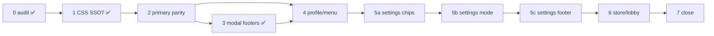

# BTN-001 — Button Unification Epic

**Status:** `implemented` (Phases 0–7 ✅ 2026-06-15; manual TMA visual QA @375px pending — `.cursor/VISUAL_QA_CHECKLIST.md` § BTN-001)  
**Epic:** Повна уніфікація інтерактивних кнопок у `packages/client` — **6 канонічних типів**, один SSOT стилів, мінімум сирих `<button>`.  
**Scope:** `packages/client` only  
**Пов’язано:** [`UI_TOKENS.md`](./UI_TOKENS.md#button-taxonomy), [`TMA_LAYOUT.md`](./TMA_LAYOUT.md), [`LAYOUT_SURFACE_UNIFICATION_PROMPTS.md`](./LAYOUT_SURFACE_UNIFICATION_PROMPTS.md), [`TYPOGRAPHY_UNIFICATION.md`](./TYPOGRAPHY_UNIFICATION.md)

---

## User story

**Як** гравець і розробник,  
**я хочу** щоб усі кнопки в додатку виглядали з однієї системи (як на головному екрані),  
**щоб** не було «брудних» тіней, різких обводок і ad-hoc `rounded-full` pills, а ієрархія дій читалась одразу.

**Acceptance criteria (epic close):**

1. У додатку **≤6 канонічних типів** кнопок (див. [Цільова таксономія](#цільова-таксономія-6-типів)); решта — задокументовані винятки (Admin, GameFlow).
2. **0** сирих `<button>` з inline Tailwind для screen/modal **CTA** (primary / secondary / tertiary / ghost).
3. Усі screen-level main actions — `size="xl"` + `rounded-theme` + SSOT depth (`styles.css`).
4. `Button` primary у модалках візуально узгоджений з `AccentFooterCta` (soft-pill accent, без flat fill).
5. `pnpm typecheck` + `@movli/client` tests green після кожної фази.
6. `docs/UI_TOKENS.md` § Button taxonomy синхронізований з цим epic (посилання, не дубль таблиць).

---

## Еталон — головний екран (`MenuScreen`)

На home вже зафіксовано **4 типи** — це зразок для всього app UI (не GameFlow):

| # | Тип | Компонент | Приклад DE | Візуал |
|---|-----|-----------|------------|--------|
| **1** | **Icon** | `GlassIconButton` | Profile, Settings, Rules | Liquid glass chip у header |
| **2** | **Primary CTA** | `AccentFooterCta` `variant="animated"` | SPIEL ERSTELLEN | Accent soft-pill + ambient halo |
| **3** | **Secondary** | `Button` `variant="secondary"` `size="xl"` | BEITRETEN | Neutral soft-pill, чітка нижня тінь + hairline border |
| **4** | **Tertiary** | `Button` `variant="tertiary"` `size="xl"` | OFFLINE-MODUS | Той самий pill, приглушений fill |

Додатково на інших екранах (не home, але той самий канон):

| # | Тип | Компонент | Коли |
|---|-----|-----------|------|
| **5** | **Ghost** | `Button` `variant="ghost"` | Cancel / dismiss у модалках і sheets |
| **6** | **Nav row** | `<button>` + `SURFACE_NAV_ROW_CLASS` | Profile nav, store rows — **не pill**, glass list row |

> **Не кнопки-CTA** (окремий патерн, не входять у «6 типів»): `CategoryChipGrid`, `LanguageChipRow`, `SettingsToggle` — **selection controls**.  
> **Семантика без нової геометрії:** `danger` / `dangerSolid` — той самий pill, інша палітра.

---

## Поточний стан (аудит 2026-06-15)

| Метрika | Значення | Коментар |
|---------|----------|----------|
| `<Button>` usages | **43** | ~52% без явного variant → flat `primary` |
| `<AccentFooterCta>` | **3** | Menu, Lobby start, Profile footer |
| `<GlassIconButton>` | **6** | Menu header + overflow |
| Сирі `<button>` (усього) | **~148** | Без tests; включає nav rows, chips, admin |
| **Орієнтовно клікабельних** | **~200** | |
| Частка на каноні (CTA + icon) | **~25%** | 52 / 200 |
| Home menu | ✅ | 4 типи з таблиці вище |
| Найбільший борг | `SettingsScreen.tsx` (**20** raw), Store/Decks (**28**), Admin (**24**), Profile ad-hoc (**17**) |

### Відомі проблеми (виправлено / відкрито)

| Проблема | Статус |
|----------|--------|
| Різкі inset-лінії на accent CTA | ✅ Fixed — soft-pill (`styles.css` `.lobby-start-btn--*`) |
| «Брудне» bg-glow на neutral кнопках (світла тема) | ✅ Fixed — border + tight drop shadow |
| Tagline «Sag · Rate» занадто блідий | ✅ Fixed — `font-semibold`, без `opacity-50` |
| Блок «ODER» затиснутий | ✅ Fixed — `py-3 my-1`, тонші лінії |
| Offline icon+text центрування | ✅ Fixed — inner flex group у `Button` |
| `Button primary` у модалках ≠ accent CTA volume | ✅ Phase 2 — `volume="cta"` |
| Profile guest login `rounded-full` + raw styles | ✅ Phase 4 — `AccentFooterCta` + `Button volume="cta"` |
| Lobby `SettingsScreen` 20× inline buttons | ✅ Phase 5 complete (5a chips; 5b mode/time; 5c footer + SectionHeader → **0** raw) |

---

## Цільова таксономія (6 типів)

```
┌─────────────────────────────────────────────────────────┐
│  HEADER:  [Icon] [Icon] [Icon]     ← Type 1 GlassIcon   │
├─────────────────────────────────────────────────────────┤
│                                                         │
│              [ Primary CTA xl ]    ← Type 2 Accent      │
│              [ Secondary xl  ]    ← Type 3 Button sec  │
│                   — oder —                              │
│              [ Tertiary xl   ]    ← Type 4 Button ter   │
│                                                         │
│  Profile list row ─────────────►  ← Type 6 Nav row      │
│                                                         │
│  Modal: [Primary] [Ghost cancel]  ← Type 2/5            │
└─────────────────────────────────────────────────────────┘
```

### Матриця «тип → API → CSS»

| Тип | React API | Size (screen) | CSS SSOT | Заборонено |
|-----|-----------|---------------|----------|------------|
| **1 Icon** | `GlassIconButton` | 44×44 tap | `.ui-glass-icon-btn`, `glass.css` | raw header `<button>` |
| **2 Primary** | `AccentFooterCta` або `Button variant="primary" volume="cta"` | `xl` / CTA shell | `.lobby-start-btn--ready`, `.lobby-start-btn--plain`, `.lobby-start-btn--blocked` | flat `bg-ui-accent` без depth; `rounded-full` на screen CTA |
| **3 Secondary** | `Button variant="secondary"` | `xl` (screen), `lg`/`md` (modal) | `.ui-soft-btn--neutral` | `border-ui-border` + wide blur shadow |
| **4 Tertiary** | `Button variant="tertiary"` | `xl` (screen), `md` (sheet) | `.ui-soft-btn--neutral-muted` | прозорий fill + жорстка рамка |
| **5 Ghost** | `Button variant="ghost"` | `lg` у modal footer | Tailwind у `Button.tsx` | ghost як primary substitute |
| **6 Nav row** | `<button className={SURFACE_NAV_ROW_CLASS}>` | fixed row height | `surfaceClasses.ts` + `.ui-glass-panel` | pill CTA стилі на list row |

### Семантичні модифікатори (не нові типи)

| Модифікатор | API | Візуал |
|-------------|-----|--------|
| **Danger** | `variant="danger"` / `"dangerSolid"` | Той самий pill/outline, палітра `--ui-danger` |
| **Blocked CTA** | `AccentFooterCta variant="blocked"` | `.lobby-start-btn--blocked` |
| **Loading** | `loading` на `AccentFooterCta` / `disabled` на `Button` | Spinner, без зміни типу |

### Розміри (`Button` / CTA)

| Size | Padding | Коли |
|------|---------|------|
| `xl` | `px-10 py-5` | Screen main actions (як home) |
| `lg` | `px-8 py-4` | Modal primary/secondary footer |
| `md` | `px-6 py-3` | Compact forms, sheets |
| `sm` | `px-4 py-2` | Inline escape (QuickJoin icon submit) |

**Правило:** на одному екрані не mix `xl` + ad-hoc `h-14` / `py-3.5` для тих самих ролей.

---

## SSOT у коді (після epic)

| Шар | Файл | Відповідальність |
|-----|------|------------------|
| Компоненти | `Button.tsx`, `AccentFooterCta.tsx`, `GlassIconButton.tsx` | Props, haptics, sound, class composition |
| Depth / pill | `styles.css` | `.lobby-start-btn--*`, `.ui-soft-btn--*`, `.accent-footer-cta-shell--*` |
| Surfaces | `constants/surfaceClasses.ts` | Nav row, accent nav row |
| Theme colors | `constants/themes.ts` → `theme.button` | **Лише** bg/hover/pressed/color — **не** shadow/border |
| Документація | `UI_TOKENS.md` § Button | Коротка таблиця + link сюди |

### Запропонований refactor Phase 2 (optional API)

Об’єднати accent depth для modal primary:

```tsx
// Button.tsx — новий prop (Phase 2)
volume?: 'flat' | 'cta'; // default 'flat' → Phase 2b: default 'cta' for size xl primary

// primary + volume="cta" → додає lobby-start-btn lobby-start-btn--plain + theme.button
```

Альтернатива без нового prop: усі modal primary → `className="lobby-start-btn lobby-start-btn--plain"` + `themeClass` (менше API, більше copy-paste).

**Рекомендація epic:** prop `volume="cta"` для `Button variant="primary"`.

---

## Задокументовані винятки (не мігрувати в 6 типів)

| Область | Причина | Політика |
|---------|---------|----------|
| **`packages/client/src/screens/GameFlow/**`** | Display scale, game UX | TYPO-001 whitelist; не pill CTA |
| **`packages/client/src/screens/admin/**`** | Compact monospace admin | `font-mono text-xs`; окремий visual tier |
| **Chip / toggle** | Selection, не action | `CategoryChipGrid`, `LanguageChipRow`, `SettingsToggle` |
| **QuickJoin icon submit** | Input adornment | `Button size="sm"` або icon-only escape |

---

## Фази реалізації

### Phase 0 — Audit ✅

- [x] Підрахунок `<Button>`, `<button>`, `AccentFooterCta`, `GlassIconButton`
- [x] Home menu soft-pill (accent + neutral + muted)
- [x] Цей документ

**Verify:** `pnpm --filter @movli/client test MenuScreen.buttons`

---

### Phase 1 — CSS SSOT lock ✅

- [x] `.ui-soft-btn--neutral` / `--neutral-muted` — border + downward shadow
- [x] `.lobby-start-btn--ready|plain|blocked` — accent soft-pill
- [x] Прибрано snake ring; ambient halo only
- [x] `themes.ts` — `button` без `border` / `shadow-lg`

**Verify:** visual QA home @375px + Warm Paper (`PAPER_LUXE`)

---

### Phase 2 — Primary parity (modal + screen) ✅

| Крок | Дія | Файли |
|------|-----|-------|
| 2.1 | Додати `volume?: 'flat' \| 'cta'` у `Button` | `Button.tsx` ✅ |
| 2.2 | `primary` + `volume="cta"` → `lobby-start-btn lobby-start-btn--plain` + shadows | `Button.tsx` ✅ |
| 2.3 | Мігрувати modal primary на `volume="cta"` `size="lg"` | ConfirmationModal, EnterNameSheet, UnsavedChangesModal, QuickBuyModal, AddOfflinePlayerSheet ✅ |
| 2.4 | Game over / scoreboard primary | GameOverScreen, ScoreboardScreen, RoundSummaryScreen, VSScreen, PreRoundScreen ✅ |
| 2.5 | Unit tests для `volume="cta"` classes | `Button.test.tsx` ✅ |

**Verify:**

```bash
pnpm typecheck
pnpm --filter @movli/client test
```

---

## Session prompts (окремі сесії)

### Шаблон на кожну сесію

```
Перед змінами: .cursor/CURRENT_FOCUS.md, docs/BUTTON_UNIFICATION.md (секція фази), docs/UI_TOKENS.md § Button.
Після: pnpm typecheck, pnpm --filter @movli/client test (релевантні describe), CHANGELOG [Unreleased] якщо user-visible.
Scope: packages/client only. Мінімальний diff. Не чіпати GameSyncState / @movli/shared.
Не рефакторити поза scope фази. Visual QA: 375px + Warm Paper + Midnight Ruby.
```

**Стандарти:** TYPO-001, `--ui-*` tokens, tap ≥ 44px, `:active` не hover, haptics через `Button` / `AccentFooterCta`.

---

### Швидкі промти (copy-paste)

| # | Промт |
|---|--------|
| **0** | `@movli-steward BTN-001 Phase 0: pre-flight + baseline grep кнопок — docs/BUTTON_UNIFICATION.md § Session 0` |
| **1** | `@movli-steward BTN-001 Phase 1: verify CSS SSOT soft-pill (якщо щось зламалось) — docs/BUTTON_UNIFICATION.md § Session 1` |
| **2** | `@movli-steward BTN-001 Phase 2: Button volume="cta" + modal/screen primary — docs/BUTTON_UNIFICATION.md § Session 2` |
| **3** | `@movli-steward BTN-001 Phase 3: modal footers primary+ghost — docs/BUTTON_UNIFICATION.md § Session 3` |
| **4** | `@movli-steward BTN-001 Phase 4: Profile + menu outliers — docs/BUTTON_UNIFICATION.md § Session 4` |
| **5a** | `@movli-steward BTN-001 Phase 5a: SettingsScreen categories/chips — docs/BUTTON_UNIFICATION.md § Session 5a` |
| **5b** | `@movli-steward BTN-001 Phase 5b: SettingsScreen mode/time controls — docs/BUTTON_UNIFICATION.md § Session 5b` |
| **5c** | `@movli-steward BTN-001 Phase 5c: SettingsScreen footer CTA — docs/BUTTON_UNIFICATION.md § Session 5c` |
| **6** | `@movli-steward BTN-001 Phase 6: Store, decks, lobby chrome — docs/BUTTON_UNIFICATION.md § Session 6` |
| **7** | `@movli-steward BTN-001 Phase 7: docs, guardrails, epic close — docs/BUTTON_UNIFICATION.md § Session 7` |

#### Ультра-короткі (одним рядком)

```
baseline audit → §0 | soft-pill verify → §1 | primary volume="cta" → §2 | modal footers → §3
profile/menu outliers → §4 | settings 5a→5b→5c | store/lobby → §6 | close epic → §7
```

#### Порядок і залежності



---

### Session 0 — Pre-flight + baseline ✅

**Мета:** зафіксувати метрики; без змін UI (дозволено doc + daily).

**Промт:**

```
BTN-001 Phase 0. Прочитай docs/BUTTON_UNIFICATION.md.
Підрахуй: <Button>, <button>, AccentFooterCta, GlassIconButton (без *.test.tsx).
Запиши baseline у docs/daily/YYYY-MM-DD.md. Онови .cursor/CURRENT_FOCUS.md.
pnpm typecheck && pnpm --filter @movli/client test MenuScreen.buttons
```

**Acceptance:** baseline table у daily; epic doc існує.

---

### Session 1 — CSS SSOT verify ✅

**Мета:** переконатись, що home menu = еталон; виправити регресії якщо є.

**Промт:**

```
BTN-001 Phase 1 verify. Еталон: MenuScreen — 4 типи (GlassIcon, AccentFooterCta, Button secondary/tertiary).
Перевір styles.css: .lobby-start-btn--*, .ui-soft-btn--neutral, .ui-soft-btn--neutral-muted.
themes.ts button — без border/shadow-lg. Якщо регресія — мінімальний fix.
pnpm --filter @movli/client test MenuScreen.buttons AccentFooterCta
```

**Acceptance:** home soft-pill без «брудного» glow на Warm Paper.

---

### Session 2 — Primary parity ✅

**Мета:** `Button variant="primary" volume="cta"` = accent soft-pill як `AccentFooterCta plain`.

**Промт:**

```
BTN-001 Phase 2. Додай prop volume?: 'flat' | 'cta' у Button.tsx.
primary + volume="cta" + themeClass → lobby-start-btn lobby-start-btn--plain + theme.button.
Мігруй primary у: ConfirmationModal, EnterNameSheet, UnsavedChangesModal, QuickBuyModal,
LoginModal, LogoutConfirmBottomSheet, AddOfflinePlayerSheet, AssignPlayerSheet,
GameOverScreen, ScoreboardScreen, RoundSummaryScreen, VSScreen, PreRoundScreen.
Додай Button.test.tsx для volume="cta". Мінімальний diff. pnpm typecheck && pnpm --filter @movli/client test.
```

**Grep gate (після):**

```bash
rg 'variant="primary"' packages/client/src --glob "*.tsx" --glob "!**/*.test.tsx"
# кожен screen/modal primary має volume="cta" або AccentFooterCta
```

**Acceptance:** 0 flat primary CTA без depth у modal/screen flows.

---

### Session 3 — Ghost + modal footers ✅

**Мета:** усі modal/sheet footer = `primary volume="cta" size="lg"` + `ghost size="lg" fullWidth`.

**Промт:**

```
BTN-001 Phase 3. Уніфікуй modal footers за .cursor/rules/07-modals.mdc.
Файли: AppSettingsModal, AdminApp, ImposterScreen, PlayerStatsScreen, RulesScreen + решта modals з Button.
Primary: volume="cta" size="lg". Cancel: variant="ghost" size="lg" fullWidth.
Прибери raw <button> з modal footers. Оновити/додати Vitest де змінилась розмітка.
pnpm typecheck && pnpm --filter @movli/client test
```

**Acceptance:** modal pairs primary+ghost; 0 raw CTA у sheets/modals.

---

### Session 4 — Profile & menu outliers

**Мета:** прибрати `rounded-full` + ad-hoc CTA на profile/menu.

**Промт:**

```
BTN-001 Phase 4. Мігруй:
- ProfileScreen guest login → AccentFooterCta variant="plain" або Button secondary xl
- ProfileNavList accent row → перевір SURFACE_NAV_ACCENT_BTN_CLASS + lobby-start-btn--plain
- RulesModal tabs → chip pattern (CategoryChipGrid-style), не rounded-full pills
- ProfileSettingsScreen rounded-full theme.button → CategoryChipGrid / SettingsToggle
- JoinInputScreen, QuickJoinSheet → Button; icon submit → Button size="sm" variant="ghost"
Grep: rg "rounded-full.*theme\.button|theme\.button.*rounded-full" packages/client/src/screens/menu profile -g "*.tsx"
pnpm typecheck && pnpm --filter @movli/client test ProfileScreen MenuScreen.buttons
```

**Acceptance:** 0 `rounded-full` + `theme.button` на profile/menu CTA.

---

### Session 5a — SettingsScreen: categories & chips ✅

**Мета:** перша третина боргу — inline category/mode toggles.

**Acceptance:** categories block без inline chip buttons. ✅ `SettingsChip` SSOT; `SettingsTabBar`, `PackChipRow`; `CategoryChipGrid` refactored; pack reset/custom-deck → `Button`.

---

### Session 5b — SettingsScreen: mode & time ✅

**Мета:** mode selectors, round time, numeric +/-.

**Acceptance:** raw count у SettingsScreen ≤ 5. ✅ `SettingsChip` для mode/variant/timer pills; `Button sm secondary` для +/-; `SettingsToggle` для quiz penalty; `RoundTimeStepper` / `ScoreStepper` helpers; **1** raw `<button>` (SectionHeader accordion).

---

### Session 5c — SettingsScreen: footer CTA ✅

**Мета:** footer save CTA + SectionHeader accordion → **0** raw `<button>`.

**Acceptance:** SettingsScreen **0** raw `<button>`. ✅ `Button primary volume="cta" size="xl"` footer; `SectionHeader` → `Button variant="ghost"`; `rg "<button" SettingsScreen.tsx` → 0.

---

### Session 6 — Store, decks, lobby chrome

**Промт:**

```
BTN-001 Phase 6. Мігруй raw buttons:
StoreScreen, QuickBuyModal, MyDecksScreen, MyWordPacksScreen, CustomDeckModal,
LobbyScreen, TeamCard, PlayersSection, LobbyPlayModeBar, TeamSetupScreen.
Nav/list → SURFACE_NAV_ROW_CLASS. CTA → Button types 2–4 або AccentFooterCta.
Kick/overflow → ghost sm або GlassIconButton. Не чіпати admin/ GameFlow.
Grep до/після: rg "<button" packages/client/src/screens/menu packages/client/src/screens/lobby -g "*.tsx" -c
pnpm typecheck && pnpm --filter @movli/client test
```

**Acceptance:** Store/Decks raw `<button>` −80%; lobby CTA на каноні. ✅ Store/Decks scope **0** raw; `LobbyScreen`, `TeamCard`, `PlayersSection`, `LobbyPlayModeBar`, `TeamSetupScreen` **0** raw; footer CTAs → `Button primary volume="cta" size="xl"`.

---

### Session 7 — Docs, guardrails, epic close

**Промт:**

```
BTN-001 Phase 7 — close epic.
1) UI_TOKENS.md § Button — sync з 6 типами (link сюди, без дублю).
2) .cursor/VISUAL_QA_CHECKLIST.md — секція BTN-001.
3) BUTTON_UNIFICATION.md status → implemented.
4) CHANGELOG [Unreleased] epic close.
5) Optional CI grep allowlist для raw <button> у menu/lobby CTA paths.
pnpm verify
```

**Acceptance:** doc↔code sync; status `implemented`; verify green. ✅

---

### Phase 3 — Ghost + modal footers ✅

**Мета:** усі modal/sheet footer pairs = `primary (volume cta)` + `ghost lg fullWidth`. Деталі → **Session 3**.

| Файл | Ціль |
|------|------|
| `ConfirmationModal.tsx` | ✅ pattern reference |
| `AppSettingsModal.tsx` | ✅ SettingsToggle; theme cards — selection (Phase 4 chips) |
| `AdminApp.tsx`, `ImposterScreen.tsx`, `RulesScreen.tsx` | ✅ |
| `EnterNameSheet`, `AddOfflinePlayerSheet`, `QuickBuyModal` | ✅ primary+ghost |
| `CustomDeckModal.tsx` | ✅ form/login CTAs → Button |
| `PlayerStatsScreen.tsx` | ✅ Phase 4 — `Button volume="cta"` screen CTAs |

---

### Phase 4 — Profile & menu outliers ✅

**Мета:** 0 `rounded-full` + `theme.button` на profile/menu CTA. Деталі → **Session 4**.

| Файл | Зміна |
|------|-------|
| `ProfileScreen.tsx` | ✅ guest/login footer — `AccentFooterCta variant="plain"` |
| `ProfileNavList.tsx` | ✅ store row — `SURFACE_NAV_ACCENT_BTN_CLASS` + `lobby-start-btn--plain` |
| `RulesModal.tsx` | ✅ tabs — chip pattern (`rounded-xl`, accent border) |
| `ProfileSettingsScreen.tsx` | ✅ save footer `volume="cta"`; `SettingsToggle`; inline CTAs → `Button` |
| `LobbySettingsScreen.tsx` | ✅ save footer `volume="cta"` |
| `JoinInputScreen.tsx` | ✅ primary `volume="cta"` + ghost cancel |
| `QuickJoinSheet.tsx` | ✅ icon submit → `Button size="sm" variant="ghost"` |
| `PlayerStatsScreen.tsx` | ✅ empty/guest CTAs `volume="cta"` |

**Verify:** `pnpm typecheck` + `ProfileScreen` / `MenuScreen.buttons` / related Vitest ✅

---

### Phase 5 — Lobby settings ✅

**Мета:** `SettingsScreen.tsx` raw `<button>` → **0**. Підфази **5a → 5b → 5c** (окремі сесії). ✅

---

### Phase 6 — Store, decks, lobby chrome ✅

**Мета:** Store/Decks raw `<button>` **−80%**. Деталі → **Session 6**. ✅

| Файл | Raw btn (до) | Після |
|------|--------------|-------|
| `StoreScreen.tsx` | 8 | **0** — tabs/lang → `SettingsChip`; buy/add → `Button` |
| `MyDecksScreen.tsx` | 4 | **0** — footer `volume="cta"`; delete ghost; copy secondary |
| `MyWordPacksScreen.tsx` | 6 | **0** — same + locked-screen CTA |
| `CustomDeckModal.tsx` | 7 | **0** — list actions ghost/secondary; tabs `SettingsChip` |
| `QuickBuyModal.tsx` | 0 | ✅ (Phase 3) |
| `LobbyScreen.tsx` | 6 | **0** — retry/tryAgain secondary; lock ghost sm |
| `TeamCard.tsx` | 5 | **0** — join/leave `Button`; rename ghost sm |
| `PlayersSection.tsx` | 4 | **0** — kick danger ghost; add player tertiary dashed |
| `LobbyPlayModeBar.tsx` | 5 | **0** — mode `SettingsChip`; stepper `Button sm secondary` |
| `TeamSetupScreen.tsx` | 4 | **0** — shuffle ghost; start `volume="cta"` |

**Verify:** `pnpm typecheck` + `StoreScreen` / `LobbyScreen` / `LobbyPlayModeBar` Vitest ✅

### Phase 7 — Docs, guardrails, close ✅

**Мета:** status `implemented`, `pnpm verify`. Деталі → **Session 7**. ✅

| Крок | Результат |
|------|-----------|
| 7.1 | `UI_TOKENS.md` § Button — status `implemented`, link canon (без дублю таблиць) |
| 7.2 | `.cursor/VISUAL_QA_CHECKLIST.md` — секція BTN-001 |
| 7.3 | Epic status → `implemented` |
| 7.4 | `CHANGELOG` [Unreleased] epic close |
| 7.5 | `buttonGovernance.test.ts` — SSOT classes, zero-raw scope, allowlist, `volume="cta"` gate |

**Verify:** `pnpm verify` + `pnpm --filter @movli/client test buttonGovernance`

---

## Governance (grep gates + allowlist)

Automated: `packages/client/src/constants/buttonGovernance.test.ts`.

Manual (pre-PR):

```bash
# Screen/modal primary must use accent depth
rg 'variant="primary"' packages/client/src --glob "*.tsx" --glob "!**/*.test.tsx"
# → кожен match має volume="cta" (або AccentFooterCta / danger variant)

# Migrated scope — 0 raw CTA buttons
rg "<button" packages/client/src/screens/menu/MenuScreen.tsx \
  packages/client/src/screens/menu/StoreScreen.tsx \
  packages/client/src/screens/lobby/SettingsScreen.tsx \
  packages/client/src/screens/lobby/LobbyScreen.tsx -c
# → 0 для кожного

# Заборона ad-hoc pill CTA на profile/menu
rg "rounded-full.*theme\.button|theme\.button.*rounded-full" \
  packages/client/src/screens/menu packages/client/src/screens/profile -g "*.tsx"
# → 0
```

### Raw `<button>` allowlist (menu / lobby)

| Файл | Max | Причина |
|------|-----|---------|
| `profile/ProfileNavList.tsx` | 6 | Type 6 nav row |
| `ProfileScreen.tsx` | 2 | Type 6 guest nav rows |
| `RulesModal.tsx` | 4 | chip tab selection |
| `EnterNameSheet.tsx` | 1 | avatar emoji picker |
| `profile/ProfileStatsCards.tsx` | 1 | stat card tap |
| `profile/ProfileBenefitsList.tsx` | 1 | benefits list row |
| `lobby/components/OnlineLobbyIntro.tsx` | 1 | intro dismiss |
| `lobby/components/LobbyAvatarStrip.tsx` | 3 | avatar strip chips |
| `lobby/components/UnassignedPool.tsx` | 1 | emoji avatar chip |
| `lobby/components/LobbyRulesSummaryCard.tsx` | 1 | rules card link |
| `lobby/components/AddOfflinePlayerSheet.tsx` | 1 | avatar emoji picker |

**Не мігрувати:** `GameFlow/**`, `admin/**`, selection controls (`SettingsChip`, `CategoryChipGrid`, `SettingsToggle`).

---

## Інвентар міграції (пріоритет)

| P | Файл | Raw btn | `<Button>` | Цільові типи |
|---|------|---------|------------|--------------|
| P0 ✅ | `MenuScreen.tsx` | 0 | 2 | 2–4 |
| P1 | `ConfirmationModal.tsx` | 0 | 2 | 2, 5 |
| P1 | `LobbyStartPanel.tsx` | 0 | 0 | 2 (Accent) |
| P2 | `SettingsScreen.tsx` | 0 ✅ | — | chips + 2/3/4/5 (Phase 5 complete) |
| P2 | `StoreScreen.tsx` | 0 ✅ | — | 6, 2/3 |
| P2 | `CustomDeckModal.tsx` | 0 ✅ | — | 5, 6, 3 |
| P2 | `MyDecksScreen.tsx` | 0 ✅ | — | 2, 5 |
| P2 | `MyWordPacksScreen.tsx` | 0 ✅ | — | 2, 5 |
| P3 | `LobbyScreen.tsx` | 0 ✅ | — | 5, 1 |
| P3 | `LobbyPlayModeBar.tsx` | 0 ✅ | — | chips + 3/4 |
| P3 | `TeamCard.tsx` | 0 ✅ | — | 2–4, ghost |
| P3 | `PlayersSection.tsx` | 0 ✅ | — | danger ghost, tertiary |
| P3 | `TeamSetupScreen.tsx` | 0 ✅ | — | 2, 5 |
| P3 | `ProfileScreen.tsx` | 0 ✅ | — | 2/3, 6 |
| P3 | `ProfileNavList.tsx` | 6 | 0 | 6, 2-plain |
| P4 | `admin/tabs/*.tsx` | 24 | — | **exception** |
| P4 | `GameFlow/**` | 9 | ~15 | **exception** |

---

## Visual QA checklist (BTN-001)

Після кожної фази — **375px TMA** + **Warm Paper** + **Midnight Ruby**:

- [ ] Home: 4 типи візуально в одній сім’ї; offline muted vs join
- [ ] Primary CTA: accent glow без perimeter line
- [ ] Secondary/tertiary: немає «брудної» плями під кнопкою на світлому фоні
- [ ] Modal: primary має той самий volume, ghost — без fill
- [ ] Profile nav rows — glass, не pill
- [ ] Tap: scale 0.97, haptic на Button/AccentFooterCta
- [ ] `prefers-reduced-motion`: blocked pulse off; no snake

---

## Правила для AI / PR (коротко)

1. **Нова screen CTA** → тип 2–4; не raw `<button>`.
2. **Не додавати** `shadow-lg`, `border border-ui-border` у `themes.ts` `button`.
3. **Не додавати** `rounded-full` на screen actions (виняток: admin, game).
4. **Shared зміни** → `styles.css` + `Button.tsx`; не inline на consumer.
5. **Тести:** class assertions на `ui-soft-btn--*`, `lobby-start-btn--*` де релевантно.

---

## Історія

| Дата | Зміна |
|------|-------|
| 2026-06-15 | Epic opened; Phase 0–1; home soft-pill; session prompts § Session 0–7 |
| 2026-06-15 | Phases 2–7 complete; `volume="cta"`; menu/lobby/store migration; governance test; epic **implemented** |
