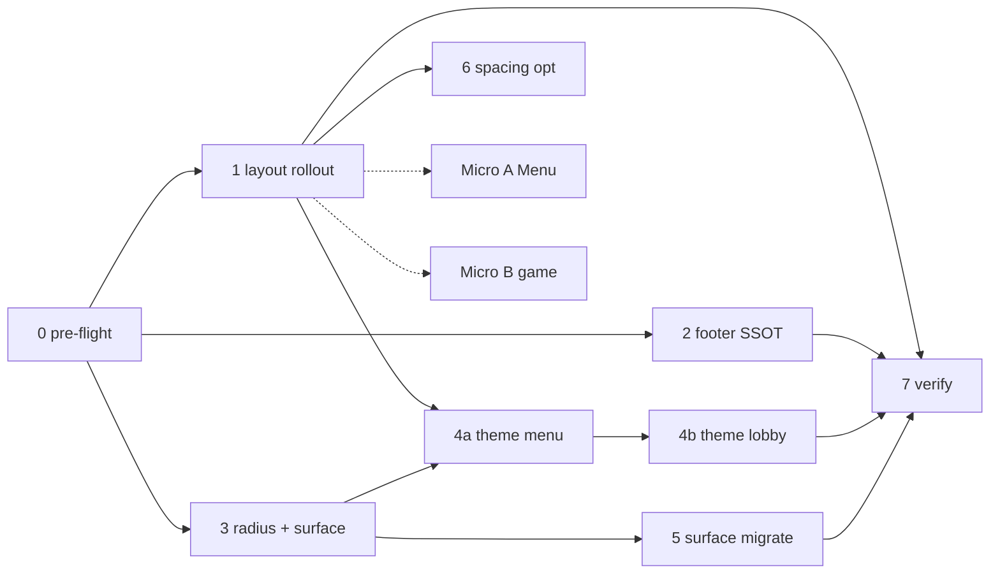

# LAYOUT-001 — Layout, Surface & Radius Unification

**Status:** `implemented` (Phases 0–7 ✅, 2026-06-11)  
**Epic:** Уніфікація screen layout presets, footer width, border radius, surface patterns і поступова міграція `currentTheme.*` legacy  
**Scope:** `packages/client` only (без `@alias/shared` / server, якщо не вказано явно)  
**Пов’язано:** [`UI_TOKENS.md`](./UI_TOKENS.md), [`TMA_LAYOUT.md`](./TMA_LAYOUT.md), [`TYPOGRAPHY_UNIFICATION.md`](./TYPOGRAPHY_UNIFICATION.md), [`PROFILE_LOBBY_SETTINGS_IMPROVEMENT_PROMPTS.md`](./PROFILE_LOBBY_SETTINGS_IMPROVEMENT_PROMPTS.md)

---

## User story

**Як** розробник / дизайнер TMA,  
**я хочу** однакові правила layout inset, footer width, radius і card surfaces на всіх menu/lobby екранах,  
**щоб** header back rail збігався з body padding, CTA-острови не «стрибали» по ширині, а теми з різним `borderRadius` виглядали послідовно.

**Acceptance criteria (epic):**

1. Усі `ScreenShell` з горизонтальним padding використовують `layout=` preset — **без дубльованих `px-*` / `max-w-*` у `contentClassName`**, що повторюють preset.
2. Footer island `contentClassName` береться з SSOT (`footerLayout.ts`) — **0 ad-hoc `max-w-*` на island footers** (окрім задокументованих винятків).
3. Interactive surfaces (кнопки, CTA, inputs) використовують `rounded-[var(--theme-radius)]` або `.rounded-theme` — не hardcoded `rounded-2xl` на primary controls.
4. Card/panel surfaces на menu/lobby/settings мають SSOT у `surfaceClasses.ts` (розширення `profileSurfaceClasses.ts`).
5. `pnpm typecheck` + client unit tests green після кожної фази.
6. `docs/UI_TOKENS.md` + `TMA_LAYOUT.md` синхронізовані з кодом (floor 104px, footer presets).

---

## Поточний стан (epic close 2026-06-11)

| Метрика | Baseline (Phase 0) | Після Phase 7 | SSOT |
|---------|-------------------|---------------|------|
| `ScreenShell` + `layout=` preset | **14** | **19** файлів (allowlist: `MyWordPacksScreen` loading spinner — без body inset) | `screenLayout.ts` |
| `ScreenShell` без `layout=` (body screens) | **6** | **0** (1 loading branch allowlisted) | Phase 1 ✅ |
| `island contentClassName="max-w` | **8+** | **0** | `footerLayout.ts` ✅ |
| `rounded-theme` / surface SSOT | **2** files | `Button`, `AccentFooterCta` + `surfaceClasses.ts` | Phase 3/5 ✅ |
| `currentTheme.textMain/Secondary` menu+lobby | **86** menu | **8** (7 menu + 1 lobby — deferred `font-serif` titles) | Phase 4a/4b ✅ |
| Spacing tokens | немає | `spacing.ts` (5 constants, 3 pilot screens) | Phase 6 ✅ |
| `TMA_LAYOUT.md` floor | doc **88px**, code **104px** | **104px** synced | Phase 7 ✅ |
| `text-[Npx]` app UI (excl. GameFlow) | — | **1** whitelist (`text-[18px]` icon glyph) | TYPO-001 |

**Вже зроблено (не чіпати без причини):** TYPO-001 ✅, Liquid Glass ✅, `screenLayout.ts` foundation ✅, `profileSurfaceClasses.ts` ✅, `ScreenLayoutContext` ✅.

---

## Цільова система

### Screen layout presets (`screenLayout.ts`)

| Preset | Body classes | Коли |
|--------|--------------|------|
| `canonical` | `max-w-2xl mx-auto px-6 md:px-8` | Profile, Store, settings menu |
| `narrow` | `max-w-md mx-auto px-6 md:px-8` | Player stats |
| `fullPx4` | `w-full px-4` | Online lobby |
| `fullPx6` | `w-full px-6` | My decks, scoreboard, game over |
| `fullPx8` | `w-full px-8` | Team setup, VS, pre-round, round summary |
| `wideMd` | `w-full px-6 md:px-10` | Join code, rules |

**Правило:** `contentClassName` — лише vertical layout (`py-*`, `gap-*`, `flex`, `justify-*`), **не** horizontal `px-*` / `max-w-*` якщо є `layout=`.

### Footer island presets (новий `footerLayout.ts`)

| Preset | Classes | Коли |
|--------|---------|------|
| `narrow` | `max-w-sm mx-auto w-full` | Single primary CTA (lobby start, profile logout) |
| `canonical` | `max-w-2xl mx-auto w-full` | Save bar, store trust strip, settings host footer |
| `fullBleed` | `w-full px-6` | Full-width CTA row (MyDecks create — якщо залишиться) |

**Default `FixedBottomBar`:** `max-w-sm` (не змінювати без Phase 2).

### Border radius

| Рівень | API | Приклад |
|--------|-----|---------|
| Theme-aware | `rounded-[var(--theme-radius)]` або `.rounded-theme` | Button, CTA, inputs |
| Fixed glass | `rounded-2xl` / `rounded-3xl` у `surfaceClasses` | Frosted panels (не theme pill) |
| Sheet | `--ui-sheet-radius` (28px) | ModalSheet only |

### Surface patterns (`surfaceClasses.ts`)

| Клас / константа | Призначення |
|------------------|-------------|
| `SURFACE_PANEL_CLASS` | `ui-glass-panel rounded-3xl` — elevated card |
| `SURFACE_CARD_CLASS` | `ui-glass-panel rounded-2xl` — list row / stat card |
| `SURFACE_NAV_ROW_CLASS` | nav row (як `PROFILE_NAV_BTN_CLASS`) |

Profile constants **реекспортують** з `surfaceClasses.ts` (backward compat).

---

## Roadmap — фази

| Фаза | Назва | P | ~час | Залежить від |
|------|-------|---|------|--------------|
| **0** | Pre-flight + baseline | — | 15 хв | — |
| **1** | Screen `layout=` rollout | P0 | 1–2 год | 0 |
| **2** | Footer island SSOT | P0 | 45–90 хв | 0 |
| **3** | Radius utilities + surface SSOT | P1 | 1–2 год | 0 |
| **4a** | Theme legacy — menu screens | P1 | 1–2 год | 1, 3 |
| **4b** | Theme legacy — lobby + settings | P1 | 2–3 год | 4a |
| **5** | Surface migration (incremental) | P2 | 2–3 год | 3 |
| **6** | Spacing tokens (optional) | P2 | 1–2 год | 1 |
| **7** | Verification + doc sync | P1 | 1 год | 1–5 |
| **8** | `font-heading` alias (optional) | P3 | 1 год | TYPO Phase 8 |

**Паралель:** 1 і 2 можна після 0; 3 незалежна від 1–2.

---

## Шаблон на кожну сесію

```
Перед змінами: .cursor/CURRENT_FOCUS.md, AUDIT_RESULTS.md, docs/LAYOUT_SURFACE_UNIFICATION_PROMPTS.md (секція сесії).
Після: pnpm typecheck, pnpm --filter @alias/client test (релевантні describe), CHANGELOG [Unreleased] якщо user-visible.
Мінімальний diff. Не чіпати GameSyncState / @alias/shared без явного запиту.
Не рефакторити поза scope сесії. Після UI — grep gates з секції сесії.
```

### Стандарти коду (обов’язково)

- **TYPO-001:** `typographyClass` / `text-ui-*` — без нових `text-sm` / `text-[Npx]` у app UI (виняток: GameFlow, icon glyphs).
- **Кольори:** `bg-ui-*`, `text-ui-*`, `border-ui-*` — не `text-white` / raw hex у TSX.
- **TMA:** tap ≥ 44px, `:active` замість hover, safe-area через preset utilities.
- **React 19:** named exports, без derived state у `useState`.
- **Тести:** оновити / додати Vitest для зміненої поведінки; не видаляти існуючі assertions без причини.

---

## Швидкі промти (copy-paste)

| # | Швидкий промт |
|---|---------------|
| **0** | `@alias-steward Виконай сесію 0 з docs/LAYOUT_SURFACE_UNIFICATION_PROMPTS.md (pre-flight + baseline grep).` |
| **1** | `@alias-steward Сесія 1: ScreenShell layout= rollout — docs/LAYOUT_SURFACE_UNIFICATION_PROMPTS.md` |
| **2** | `@alias-steward Сесія 2: footer island SSOT — docs/LAYOUT_SURFACE_UNIFICATION_PROMPTS.md` |
| **3** | `@alias-steward Сесія 3: radius + surfaceClasses foundation — docs/LAYOUT_SURFACE_UNIFICATION_PROMPTS.md` |
| **4a** | `@alias-steward Сесія 4a: theme legacy menu screens — docs/LAYOUT_SURFACE_UNIFICATION_PROMPTS.md` |
| **4b** | `@alias-steward Сесія 4b: theme legacy lobby/settings — docs/LAYOUT_SURFACE_UNIFICATION_PROMPTS.md` |
| **5** | `@alias-steward Сесія 5: surface migration incremental — docs/LAYOUT_SURFACE_UNIFICATION_PROMPTS.md` |
| **6** | `@alias-steward Сесія 6 (optional): spacing tokens — docs/LAYOUT_SURFACE_UNIFICATION_PROMPTS.md` |
| **7** | `@alias-steward Сесія 7: verification + doc sync — docs/LAYOUT_SURFACE_UNIFICATION_PROMPTS.md` |
| **A** | `Мікро A: MenuScreen layout=canonical only — docs/LAYOUT_SURFACE_UNIFICATION_PROMPTS.md` |
| **B** | `Мікро B: game transitional layout presets — docs/LAYOUT_SURFACE_UNIFICATION_PROMPTS.md` |

### Ультра-короткі (одним рядком)

```
pre-flight baseline → §0 | ScreenShell layout= → §1 | footer island SSOT → §2
radius + surfaceClasses → §3 | theme legacy menu → §4a | theme legacy lobby → §4b
surface cards migrate → §5 | spacing optional → §6 | verify + docs → §7
MenuScreen only → §A | PreRound/VS/RoundSummary/GameOver → §B
```

---

## Порядок і залежності



---

## Сесія 0 — Pre-flight + baseline

**Мета:** зафіксувати метрики; **без змін TSX** (дозволено лише `.cursor/CURRENT_FOCUS.md`, `docs/daily/`).

### Задачі

1. Прочитати: `.cursor/CURRENT_FOCUS.md`, `AUDIT_RESULTS.md`, цей файл, `packages/client/src/constants/screenLayout.ts`.
2. Запустити:
   ```bash
   pnpm typecheck
   pnpm --filter @alias/client test
   ```
3. Зафіксувати grep baseline у `docs/daily/YYYY-MM-DD.md`:
   ```bash
   rg "layout=" packages/client/src/screens --glob "*.tsx" -l
   rg "ScreenShell" packages/client/src/screens --glob "*.tsx" -l
   rg "contentClassName=.*max-w-" packages/client/src/screens --glob "*.tsx"
   rg "island contentClassName" packages/client/src/screens --glob "*.tsx"
   rg "rounded-\[var\(--theme-radius\)\]" packages/client/src --glob "*.tsx"
   rg "currentTheme\.(textMain|textSecondary)" packages/client/src/screens/menu --glob "*.tsx" -c
   ```
4. Оновити `.cursor/CURRENT_FOCUS.md` — один абзац: «LAYOUT-001 epic, старт Phase N».

### Acceptance

- Baseline команд задокументований; typecheck green (або known failures з AUDIT).
- Список 6 екранів без `layout=` підтверджений grep.

### Повний промт

```
@alias-steward Pre-flight: LAYOUT-001 Phase 0 — layout/surface unification baseline.

Контекст: docs/LAYOUT_SURFACE_UNIFICATION_PROMPTS.md (аудит 2026-06-11).
Задача:
1. Прочитай CURRENT_FOCUS, AUDIT_RESULTS, screenLayout.ts, ScreenShell.tsx.
2. pnpm typecheck && pnpm --filter @alias/client test — зафіксуй результат.
3. Запусти grep gates з секції «Сесія 0» цього doc; скопіюй counts у docs/daily/YYYY-MM-DD.md.
4. Онови .cursor/CURRENT_FOCUS.md — LAYOUT-001 planned, next Phase 1.
5. НЕ змінюй TSX/CSS у цій сесії.

Deliverable: daily note з baseline metrics.
```

---

## Сесія 1 — Screen `layout=` rollout

**Мета:** усі `ScreenShell` з body horizontal inset використовують `layout=` preset; прибрати дубльовані `px-*` / `max-w-*`.

### Файли (обов’язковий scope)

| Файл | Зміна |
|------|-------|
| `packages/client/src/screens/menu/MenuScreen.tsx` | `layout="canonical"`; прибрати `max-w-2xl mx-auto w-full` з `contentClassName` |
| `packages/client/src/screens/GameFlow/screens/GameOverScreen.tsx` | `layout="fullPx6"`; прибрати `px-6` з `contentClassName` |
| `packages/client/src/screens/GameFlow/screens/PreRoundScreen.tsx` | `layout="fullPx8"` на всі 3 `ScreenShell`; прибрати `px-8` з `className` |
| `packages/client/src/screens/GameFlow/screens/VSScreen.tsx` | `layout="fullPx8"`; прибрати `px-8` з `contentClassName` |
| `packages/client/src/screens/GameFlow/screens/RoundSummaryScreen.tsx` | `layout="fullPx8"`; прибрати `px-8` з `contentClassName` |
| `packages/client/src/screens/GameFlow/screens/CountdownScreen.tsx` | `layout="fullPx6"` (centered content, без extra px у content) |
| `packages/client/src/constants/screenLayout.test.ts` | тест: кожен preset `bodyClassName` не порожній |
| `packages/client/src/components/layout/ScreenShell.test.tsx` | тест: `layout="canonical"` merges `bodyClassName` + `contentClassName` |

### Не чіпати

- `PlayingScreen`, `ImposterScreen` — pattern E.
- `LobbyScreen`, `TeamSetupScreen` — вже мають preset.
- Game logic, `GameSyncState`, server.

### Mapping rules

```text
contentClassName="max-w-2xl mx-auto ..."  →  layout="canonical" + contentClassName без max-w/px
className={`${currentTheme.bg} px-8 ...`}   →  layout="fullPx8" + className лише bg/theme
contentClassName="px-8 ..."               →  layout="fullPx8" + contentClassName без px-8
```

### Grep gates (після)

```bash
# ScreenShell без layout= — лише завантаження / edge (має → 0 або documented)
rg "ScreenShell" packages/client/src/screens --glob "*.tsx" -l | while read f; do rg -q 'layout=' "$f" || echo "NO_LAYOUT: $f"; done

# Дубль px на shell коли є layout (має → 0)
rg "ScreenShell[\s\S]{0,200}px-[468]" packages/client/src/screens --glob "*.tsx"

pnpm typecheck
pnpm --filter @alias/client test screenLayout ScreenShell
```

### Acceptance

- 6 раніше missing screens мають `layout=`.
- Візуально @375px: Menu logo/card не зсунуті; game transitional screens — той самий horizontal inset.
- Тести green.

### Повний промт

```
@alias-steward LAYOUT-001 Phase 1 — ScreenShell layout= rollout.

Прочитай docs/LAYOUT_SURFACE_UNIFICATION_PROMPTS.md § Сесія 1 ПОВНІСТЮ перед кодом.

Prerequisite: Phase 0 baseline задокументований.

Файли (ТІЛЬКИ ці + тести):
- packages/client/src/screens/menu/MenuScreen.tsx
- packages/client/src/screens/GameFlow/screens/GameOverScreen.tsx
- packages/client/src/screens/GameFlow/screens/PreRoundScreen.tsx
- packages/client/src/screens/GameFlow/screens/VSScreen.tsx
- packages/client/src/screens/GameFlow/screens/RoundSummaryScreen.tsx
- packages/client/src/screens/GameFlow/screens/CountdownScreen.tsx
- packages/client/src/constants/screenLayout.test.ts
- packages/client/src/components/layout/ScreenShell.test.tsx

Задачі:
1. Додай layout= preset з таблиці «Файли»; прибери дубльовані px-* / max-w-* з contentClassName/className.
2. contentClassName лишає vertical-only класи (flex, gap, py, justify, items).
3. НЕ змінюй header/footer slots, game actions, sendAction, GameState transitions.
4. Онови/додай unit tests для preset merge.
5. Запусти grep gates §1; pnpm typecheck; pnpm --filter @alias/client test screenLayout ScreenShell.

Заборонено: PlayingScreen, ImposterScreen, @alias/shared, drive-by refactors інших екранів.
Після: CHANGELOG [Unreleased] Changed (1 рядок), CURRENT_FOCUS.md, daily note.
```

---

## Сесія 2 — Footer island SSOT

**Мета:** один модуль для `FixedBottomBar island contentClassName`; прибрати ad-hoc `max-w-*`.

### Deliverables

1. **Новий файл** `packages/client/src/constants/footerLayout.ts`:
   ```ts
   export type FooterIslandPreset = 'narrow' | 'canonical' | 'fullBleed';
   export const FOOTER_ISLAND_LAYOUT: Record<FooterIslandPreset, string>;
   export function footerIslandClassName(preset: FooterIslandPreset): string;
   ```
2. **Тест** `packages/client/src/constants/footerLayout.test.ts`.
3. **Експорт** з `packages/client/src/constants/index.ts` (якщо є barrel) або імпорт напряму.
4. **Міграція consumers** — замінити рядкові `contentClassName` на `footerIslandClassName('…')`:

| Файл | Preset |
|------|--------|
| `LobbyScreen.tsx` | `narrow` |
| `ProfileScreen.tsx` | `narrow` |
| `ProfileSettingsScreen.tsx` | `canonical` |
| `LobbySettingsScreen.tsx` | `canonical` |
| `StoreScreen.tsx` | `canonical` |
| `lobby/SettingsScreen.tsx` | `canonical` |
| `MyWordPacksScreen.tsx` | `canonical` (прибрати дубль `px-6 md:px-8` з footer — body вже canonical) |
| `MyDecksScreen.tsx` | `fullBleed` або `canonical` — обери один, задокументуй у footerLayout.ts comment |
| `TeamSetupScreen.tsx` | `fullBleed` (`w-full space-y-4` → preset + optional extra class) |
| `ScoreboardScreen.tsx` | `fullBleed` з `px-6` якщо потрібно match body `fullPx6` |

### Не змінювати

- Default prop у `FixedBottomBar.tsx` (`max-w-sm`) — лишається.
- `glass` / `gradient` footer modes.

### Grep gate

```bash
rg "island contentClassName=" packages/client/src/screens --glob "*.tsx"
# Кожен match має використовувати footerIslandClassName( — не raw max-w string
```

### Acceptance

- SSOT module + tests.
- Усі island footers на presets.
- `pnpm typecheck` + client tests green.

### Повний промт

```
@alias-steward LAYOUT-001 Phase 2 — footer island SSOT.

Прочитай docs/LAYOUT_SURFACE_UNIFICATION_PROMPTS.md § Сесія 2.

Створи packages/client/src/constants/footerLayout.ts + footerLayout.test.ts з presets:
- narrow: max-w-sm mx-auto w-full
- canonical: max-w-2xl mx-auto w-full
- fullBleed: w-full px-6

Мігруй ТІЛЬКИ island footers у файлах з таблиці §2. Використовуй footerIslandClassName('preset').
Для TeamSetup/MyDecks — якщо потрібен space-y-4, додай у contentClassName ПІСЛЯ preset (vertical only).

НЕ змінюй FixedBottomBar default prop. НЕ чіпай non-island footers (PreRound gradient).

Verify: grep gate §2, pnpm typecheck, pnpm --filter @alias/client test footerLayout.
CHANGELOG [Unreleased] Added: footer island layout presets.
```

---

## Сесія 3 — Radius utilities + `surfaceClasses.ts`

**Мета:** theme-aware radius utility; generalized surface SSOT; profile re-export.

### Deliverables

1. `packages/client/src/styles.css` — додати utility:
   ```css
   .rounded-theme { border-radius: var(--theme-radius); }
   ```
   (або `@theme` entry якщо Tailwind v4 pattern у проєкті вимагає `--radius-theme`)
2. **Новий** `packages/client/src/constants/surfaceClasses.ts`:
   - `SURFACE_PANEL_CLASS`, `SURFACE_CARD_CLASS`, `SURFACE_NAV_ROW_CLASS`, `SURFACE_NAV_ACCENT_BTN_CLASS`
   - Скопіюй семантику з `profileSurfaceClasses.ts`; profile файл → re-export + deprecated comment
3. `docs/UI_TOKENS.md` — секція **Border radius** + **Surface classes**
4. **Мінімальна міграція (2 файли max):**
   - `Button.tsx` — можна `rounded-theme` замість `rounded-[var(--theme-radius)]` (equivalent)
   - `AccentFooterCta.tsx` — те саме
5. `surfaceClasses.test.ts` — snapshot class strings

### Не робити в цій сесії

- Масова заміна `rounded-2xl` на cards по всьому app.
- Зміни `ThemeConfig.borderRadius` values.

### Grep gate

```bash
test -f packages/client/src/constants/surfaceClasses.ts
rg "rounded-theme|rounded-\[var\(--theme-radius\)\]" packages/client/src/components/Button.tsx
```

### Повний промт

```
@alias-steward LAYOUT-001 Phase 3 — radius utility + surfaceClasses SSOT.

Прочитай docs/LAYOUT_SURFACE_UNIFICATION_PROMPTS.md § Сесія 3 і docs/UI_TOKENS.md.

1. Додай .rounded-theme { border-radius: var(--theme-radius); } у packages/client/src/styles.css (поруч з існуючим --theme-radius).
2. Створи packages/client/src/constants/surfaceClasses.ts — panel/card/nav constants (див. § Цільова система).
3. profileSurfaceClasses.ts — re-export з surfaceClasses.ts; залиш старі імена PROFILE_* як aliases.
4. surfaceClasses.test.ts — assert константи містять ui-glass-panel / rounded-*.
5. Button.tsx + AccentFooterCta.tsx — optional migrate to rounded-theme (minimal).
6. Онови docs/UI_TOKENS.md — Border radius + Surface classes tables.

Scope: НЕ мігруй StoreScreen/RulesModal cards у цій сесії (Phase 5).
pnpm typecheck && pnpm --filter @alias/client test surfaceClasses typography
```

---

## Сесія 4a — Theme legacy: menu screens

**Мета:** menu `screens/menu/**` — менше `currentTheme.textMain/Secondary`; прямий `bg-ui-bg` на shells.

### Mapping rules

| Було | Стане |
|------|--------|
| `className={currentTheme.bg}` на ScreenShell | `className="bg-ui-bg"` (+ `transition-colors duration-500` якщо було) |
| `${currentTheme.textMain}` на ScreenTitle | `themeClass` prop лишити або прибрати якщо ScreenTitle вже `text-ui-fg` |
| `${currentTheme.textSecondary}` на body copy | `text-ui-fg-muted` + `typographyClass.body` |
| `${currentTheme.textMain}` на card title `font-serif text-lg` | лишити до Phase 5 sub-heading OR `typographyClass.heading` якщо це section title |
| `currentTheme.card` | `SURFACE_CARD_CLASS` або `bg-ui-card border border-ui-border` |

### Файли (пріоритет)

`ProfileScreen.tsx`, `ProfileSettingsScreen.tsx`, `PlayerStatsScreen.tsx`, `StoreScreen.tsx`, `MyDecksScreen.tsx`, `MyWordPacksScreen.tsx`, `LobbySettingsScreen.tsx`, `MenuScreen.tsx`, `RulesScreen.tsx`, `JoinInputScreen.tsx`, `RulesModal.tsx`, `menu/profile/*.tsx`

### Не чіпати

- `Logo` / `text-7xl`
- `GameFlow/**`
- `currentTheme.button` на `<Button themeClass=…>` — лишити (theme CTA styles)

### Grep gate (menu only)

```bash
rg "currentTheme\.(textMain|textSecondary)" packages/client/src/screens/menu --glob "*.tsx" -c
# Target: зменшити ≥50% vs Phase 0 baseline; 0 не обов'язково в 4a
```

### Повний промт

```
@alias-steward LAYOUT-001 Phase 4a — theme legacy migration (menu screens).

Прочитай docs/LAYOUT_SURFACE_UNIFICATION_PROMPTS.md § Сесія 4a.

Scope: packages/client/src/screens/menu/** та packages/client/src/screens/menu/profile/** та RulesModal.tsx.

Rules:
- ScreenShell className: currentTheme.bg → bg-ui-bg (currentTheme.bg вже equals bg-ui-bg в themes.ts — перевір grep).
- Body paragraphs: currentTheme.textSecondary → text-ui-fg-muted + typographyClass.body де доречно.
- НЕ змінюй game logic, API calls, GameState.
- НЕ чіпай font-serif text-lg card titles без явної заміни — defer sub-heading до Phase 5.
- Збережи всі data-testid / aria labels.

Verify: grep gate 4a, pnpm typecheck, pnpm --filter @alias/client test menu profile
CHANGELOG [Unreleased] Changed: menu screens use semantic ui color classes.
```

---

## Сесія 4b — Theme legacy: lobby + in-lobby settings

**Мета:** те саме для `screens/lobby/**` (крім test files).

### Файли

`LobbyScreen.tsx`, `SettingsScreen.tsx`, `TeamSetupScreen.tsx`, `lobby/components/*.tsx` (UI only)

### Особливості `SettingsScreen.tsx`

- Файл великий (~1100 LOC) — **лише** заміна color classes (`textMain`/`textSecondary`/`bg`), **не** реструктуризація секцій.
- `labelSectionClass` + `currentTheme.textMain` → `labelSectionClass` + `text-ui-fg` (прибрати redundant themeClass якщо можливо).

### Не чіпати

- Socket `sendAction`, settings payload shape, host authorization UI conditions.

### Повний промт

```
@alias-steward LAYOUT-001 Phase 4b — theme legacy migration (lobby).

Прочитай docs/LAYOUT_SURFACE_UNIFICATION_PROMPTS.md § Сесія 4b.

Scope: packages/client/src/screens/lobby/** (exclude *.test.tsx).

Rules: ті самі mapping rules що 4a. SettingsScreen.tsx — color class migration ONLY, no section reorder.
OnlineLobbyIntro, TeamCard, LobbyPlayModeBar — textSecondary → text-ui-fg-muted де це body/status copy.

Verify: pnpm typecheck, pnpm --filter @alias/client test lobby
Не чіпай RoomManager, @alias/shared, server.
```

---

## Сесія 5 — Surface migration (incremental)

**Мета:** замінити повторювані card/panel patterns на `surfaceClasses.ts` у high-traffic UI.

### Batch 1 (обов’язково)

| Файл | Заміна |
|------|--------|
| `RulesModal.tsx` | repeated card shells → `SURFACE_CARD_CLASS` / `SURFACE_PANEL_CLASS` |
| `StoreScreen.tsx` | product cards — panel class |
| `LobbySettingsScreen.tsx` | section panels |
| `ProfileSettingsScreen.tsx` | use `PROFILE_*` aliases (already) — verify consistency |

### Batch 2 (якщо час)

- `lobby/SettingsScreen.tsx` — **одна** секція (напр. Game Mode block) як пілот, не весь файл
- `MyDecksScreen.tsx` / `MyWordPacksScreen.tsx` list cards

### Правило radius на surfaces

- Glass panels: `SURFACE_*` з fixed `rounded-2xl/3xl` (OK — frosted inset pattern)
- Primary buttons/inputs: `rounded-theme`

### Grep gate

```bash
rg "ui-glass-panel rounded" packages/client/src/screens/menu --glob "*.tsx" -c
# Після batch 1: більше імпортів з surfaceClasses, менше inline duplicate strings
```

### Повний промт

```
@alias-steward LAYOUT-001 Phase 5 — incremental surface migration.

Прочитай docs/LAYOUT_SURFACE_UNIFICATION_PROMPTS.md § Сесія 5.

Prerequisite: Phase 3 surfaceClasses.ts існує.

Batch 1 (обов'язково): RulesModal.tsx, StoreScreen.tsx, LobbySettingsScreen.tsx, ProfileSettingsScreen audit.
Імпортуй SURFACE_PANEL_CLASS / SURFACE_CARD_CLASS з constants/surfaceClasses.ts.
Не змінюй layout structure модалок — лише className strings на wrapper divs.

Batch 2 (optional): одна секція SettingsScreen.tsx як пілот.

Verify: pnpm typecheck, client tests RulesModal StoreScreen LobbySettings
Visual: @375px Rules modal + Store cards — no layout break.
```

---

## Сесія 6 (optional) — Spacing tokens

**Мета:** мінімальний spacing SSOT для vertical rhythm (не повний design system).

### Deliverables

`packages/client/src/constants/spacing.ts`:

```ts
export const screenBodyPy = 'py-4';
export const sectionGap = 'space-y-5';
export const sectionGapLg = 'space-y-6';
export const stackGap = 'gap-4';
```

Міграція **3 екранів** як proof: `ProfileSettingsScreen`, `LobbySettingsScreen`, `PlayerStatsScreen` — замінити дубль `py-4 space-y-5` на constants.

`docs/UI_TOKENS.md` — секція Spacing (optional).

### Повний промт

```
@alias-steward LAYOUT-001 Phase 6 (optional) — spacing constants.

Створи packages/client/src/constants/spacing.ts з 4–6 named Tailwind fragment constants (див. §6).
Мігруй ProfileSettingsScreen, LobbySettingsScreen, PlayerStatsScreen contentClassName/inner wrappers.
Додай spacing.test.ts. Онови UI_TOKENS.md § Spacing.
pnpm typecheck + client tests.
```

---

## Сесія 7 — Verification + doc sync

**Мета:** grep governance, doc↔code, epic close.

### Doc updates

| Файл | Зміна |
|------|-------|
| `docs/TMA_LAYOUT.md` | `TELEGRAM_MOBILE_CONTENT_TOP_FLOOR_PX` → **104**; footer preset table |
| `docs/UI_TOKENS.md` | layout presets, footer presets, radius, surface (якщо не в Phase 3/6) |
| `docs/LAYOUT_SURFACE_UNIFICATION_PROMPTS.md` | Status → `implemented` |
| `.cursor/CURRENT_FOCUS.md` | LAYOUT-001 ✅ |
| `CHANGELOG.md` | [Unreleased] summary |

### Grep governance (epic close)

```bash
# 1. ScreenShell consumers мають layout= (allowlist: loading-only shells без body inset)
rg "ScreenShell" packages/client/src/screens --glob "*.tsx" -l

# 2. Island footers — footerIslandClassName
rg "island contentClassName=\"max-w" packages/client/src/screens --glob "*.tsx"
# → 0

# 3. App UI arbitrary font sizes (exclude GameFlow)
rg "text-\[[0-9]+px\]" packages/client/src --glob "*.tsx" --glob "!**/GameFlow/**"
# → whitelist only (icon 18px)

# 4. Theme legacy menu+lobby (target: <20 total occurrences or documented)
rg "currentTheme\.(textMain|textSecondary)" packages/client/src/screens/menu packages/client/src/screens/lobby --glob "*.tsx" -c

pnpm verify
```

### Manual QA @375px

- Menu → Profile → Settings → back
- Lobby → Settings (in-lobby) → save footer width
- Store footer trust bar width
- PAPER_LUXE vs PREMIUM_DARK — button radius (6px vs pill)

### Повний промт

```
@alias-steward LAYOUT-001 Phase 7 — verification + doc sync.

1. Запусти всі grep gates з § Сесія 7. Виправ мінімально якщо fail.
2. Синхронізуй TMA_LAYOUT.md floor 88→104, додай footer preset table.
3. UI_TOKENS.md — cross-link layout + footer + surface.
4. LAYOUT_SURFACE_UNIFICATION_PROMPTS.md status → implemented.
5. pnpm verify
6. docs/daily/YYYY-MM-DD.md — epic close summary + manual QA checklist (owner).

Не додавай нові фічі. Тільки fixes для grep failures.
```

---

## Мікро-сесії

### A — MenuScreen only (якщо Phase 1 занадто велика)

```
LAYOUT-001 Micro A: MenuScreen.tsx only.

layout="canonical" на ScreenShell.
Прибрати max-w-2xl mx-auto w-full з contentClassName — залишити flex/min-h-0 класи.
Перевір: AppHeader back rail alignment з body (ScreenLayoutContext).
pnpm --filter @alias/client test MenuScreen
Не чіпати інші файли.
```

### B — Game transitional screens only

```
LAYOUT-001 Micro B: GameFlow transitional layout presets.

Файли: PreRoundScreen, VSScreen, RoundSummaryScreen, GameOverScreen, CountdownScreen.
Додай layout= з §1 таблиці; прибери дубль px-*.
НЕ чіпати PlayingScreen, ImposterScreen, game actions.
pnpm typecheck + client tests
```

---

## Чеклист аудиту → сесія

| Проблема аудиту 2026-06-11 | Сесія |
|----------------------------|-------|
| 6 екранів без `layout=` | 1 / Micro A+B |
| Footer island ad-hoc max-w | 2 |
| `--theme-radius` лише на 2 компонентах | 3, 5 |
| `rounded-2xl` hardcode на cards | 5 |
| `currentTheme.*` dual system | 4a, 4b |
| Profile-only surface SSOT | 3, 5 |
| Spacing ad-hoc | 6 (optional) |
| TMA_LAYOUT floor 88 vs 104 | 7 |
| Sub-heading `text-lg font-serif` без token | defer / TYPO Phase 8 |
| Admin compact scale | defer |
| GameFlow `text-[Npx]` | свідомий виняток — не в scope |

---

## Verify після кожної сесії

```bash
pnpm typecheck
pnpm --filter @alias/client test
# після Phase 1+ UI:
rg "layout=" packages/client/src/screens/menu/MenuScreen.tsx
```

---

## Ризики та мітигація

| Ризик | Мітигація |
|-------|-----------|
| Menu card зсув після `layout=` | порівняти computed padding з canonical preset; visual @375px |
| Footer `max-w-2xl` vs `max-w-sm` product decision | задокументувати matrix у footerLayout.ts |
| PAPER_LUXE pill vs 6px на glass cards | glass panels — fixed radius; controls — `rounded-theme` |
| SettingsScreen regression | 4b/5 — color/surface only, no logic |
| `ScreenLayoutContext` + portal header | вже вирішено в ScreenShell — не змінювати portal logic |

---

## Пов’язані файли

| Файл | Роль |
|------|------|
| `packages/client/src/constants/screenLayout.ts` | Body layout presets |
| `packages/client/src/constants/footerLayout.ts` | *(Phase 2)* Footer island presets |
| `packages/client/src/constants/surfaceClasses.ts` | *(Phase 3)* Surface SSOT |
| `packages/client/src/constants/profileSurfaceClasses.ts` | Profile aliases |
| `packages/client/src/components/layout/ScreenShell.tsx` | layout prop merge |
| `packages/client/src/components/layout/FixedBottomBar.tsx` | island default `max-w-sm` |
| `packages/client/src/context/GameContext.tsx` | `--theme-radius` runtime |
| `packages/client/src/constants/themes.ts` | `borderRadius` per theme |
| `docs/UI_TOKENS.md` | Canon tokens |
