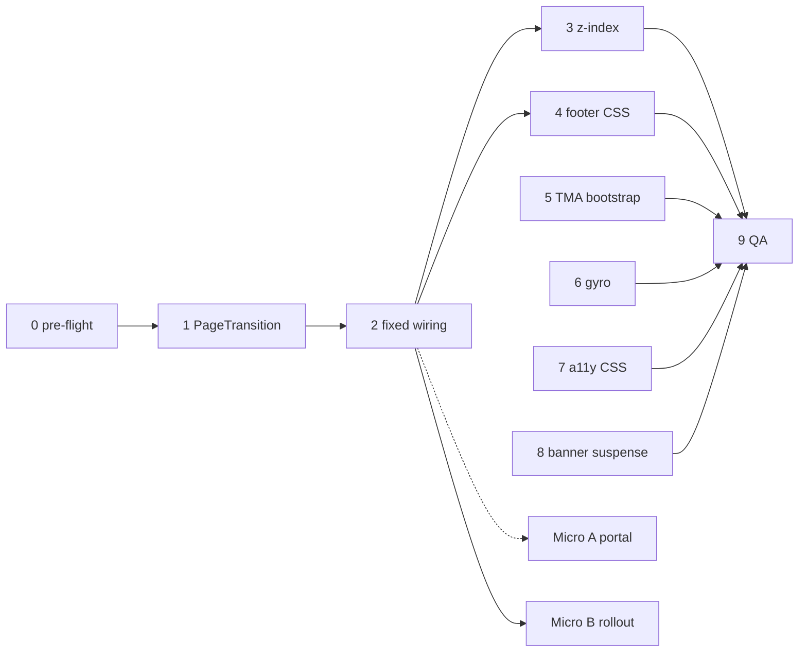

# Liquid Glass Header & Footer — промти для виправлень (2026-06)

> Джерело аудиту: сесія review `Header` / `Footer` / `GlassAppHeader` / `FooterIsland`, `glass.css`, `useGyroscope`, `useTelegramApp`.  
> Канон layout/TMA: [`TMA_LAYOUT.md`](./TMA_LAYOUT.md), UI tokens: [`UI_TOKENS.md`](./UI_TOKENS.md).

## Контекст (коротко)

| Шар | Файл | Стан після epic (Sessions 0–9 ✅) |
|-----|------|-----------------------------------|
| Header entry | `packages/client/src/components/layout/Header.tsx` | Re-export `GlassAppHeader` / `AppHeader` |
| Header impl | `packages/client/src/components/layout/GlassAppHeader.tsx` | Direct blur у `glass.css`; `fixed` + `.ui-app-header--fixed` на пілотах |
| Footer entry | `packages/client/src/components/layout/Footer.tsx` | Re-export `FooterIsland` |
| Footer island | `packages/client/src/components/layout/FooterIsland.tsx` | Fixed capsule — **пілот:** settings screens (`FixedBottomBar island`) |
| Sticky footer (legacy prod) | `packages/client/src/components/layout/FixedBottomBar.tsx` + `.ui-app-footer` | Direct blur у `glass.css` (Session 4 ✅) |
| Glass tokens | `packages/client/src/styles/glass.css` + `styles.css` | `--z-liquid-chrome: 30`; `--z-status-banner: 25` |
| Layout shell | `packages/client/src/components/layout/ScreenShell.tsx` | `headerFixed` / `footerFixed` — **2 екрани** (settings); решта sticky |
| Transform predок | `PageTransition` / `animate-page-in` | Session 1 ✅ — `transform: none` після анімації |
| TMA | `bootstrapTelegramMiniApp()` + `useTelegramApp.ts` | Sync bootstrap до `createRoot`; `isExpanded` на `viewportChanged` |
| Gyro | `useGyroscope.ts` | Лише з `FooterIsland` mount (Session 6 ✅) |

**Залишилось (post-epic):** manual TMA @375px glass QA (owner). ~~Micro A~~ ✅; ~~Micro B~~ ✅ (2026-06-10).

---

## Шаблон на кожну сесію

```
Перед змінами: .cursor/CURRENT_FOCUS.md, docs/LIQUID_GLASS_FIX_PROMPTS.md (секція сесії нижче).
Після: pnpm typecheck, pnpm --filter @movli/client test (релевантні describe), CHANGELOG [Unreleased] якщо user-visible.
Мінімальний diff. Не чіпати GameSyncState / @movli/shared без потреби.
Не рефакторити поза scope сесії. Після UI — .cursor/VISUAL_QA_CHECKLIST.md на TMA viewport 375px.
```

### Стандарти коду (обов'язково в кожному промті)

- **TYPO-001:** semantic typography з `typographyClass` / `constants/typography.ts` — без нових `text-sm` / `text-[Npx]` у app UI.
- **TMA:** `100dvh` / `--tg-viewport-height`, safe-area через `--tma-inset-*`, tap target ≥ 44px, `:active` замість hover.
- **React 19:** named exports, hooks для side effects, без derived state у `useState`.
- **CSS glass:** `backdrop-filter` + `-webkit-backdrop-filter`, GPU hint (`will-change: transform` або `translateZ(0)`), `@supports not (backdrop-filter)` fallback.
- **Fixed chrome:** blur на viewport-fixed шарі **поза** scroll і **поза** transformed предків (див. `ModalPortal` у `Shared.tsx` як референс portal-патерну).
- **Тести:** оновити / додати Vitest для зміненої поведінки (`GlassAppHeader.test.tsx`, `FixedBottomBar.test.tsx`, `ScreenShell` якщо торкнеться).

---

## Швидкі промти (copy-paste)

| # | Швидкий промт |
|---|---------------|
| **0** | `@movli-steward Виконай сесію 0 з docs/LIQUID_GLASS_FIX_PROMPTS.md (pre-flight + verify baseline).` |
| **1** | `@movli-steward Сесія 1: PageTransition без persistent transform — docs/LIQUID_GLASS_FIX_PROMPTS.md` |
| **2** | `@movli-steward Сесія 2: viewport-fixed header/footer wiring — docs/LIQUID_GLASS_FIX_PROMPTS.md` |
| **3** | `@movli-steward Сесія 3: z-index liquid-chrome vs modal — docs/LIQUID_GLASS_FIX_PROMPTS.md` |
| **4** | `@movli-steward Сесія 4: уніфікація footer blur (glass.css) — docs/LIQUID_GLASS_FIX_PROMPTS.md` |
| **5** | `@movli-steward Сесія 5: TMA bootstrap ready/expand/isExpanded — docs/LIQUID_GLASS_FIX_PROMPTS.md` |
| **6** | `@movli-steward Сесія 6: useGyroscope лише з FooterIsland — docs/LIQUID_GLASS_FIX_PROMPTS.md` |
| **7** | `@movli-steward Сесія 7: prefers-reduced-transparency + CSS cleanup — docs/LIQUID_GLASS_FIX_PROMPTS.md` |
| **8** | `@movli-steward Сесія 8: banner z-index + LazyRoute skeleton — docs/LIQUID_GLASS_FIX_PROMPTS.md` |
| **9** | `@movli-steward Сесія 9: visual QA + тести + doc sync — docs/LIQUID_GLASS_FIX_PROMPTS.md` |
| **A** | `@architect Мікро A: GlassChromePortal (fixed chrome в document.body) — docs/LIQUID_GLASS_FIX_PROMPTS.md` |
| **B** | `Мікро B: розширити fixed/island на решту екранів — docs/LIQUID_GLASS_FIX_PROMPTS.md` |

### Ультра-короткі (одним рядком)

```
pre-flight → §0 | PageTransition transform → §1 | fixed chrome wiring → §2
z-index stack → §3 | footer CSS unify → §4 | TMA bootstrap → §5
gyro scope → §6 | reduced-transparency → §7 | banner + suspense → §8
visual QA → §9 | portal pattern → §A | rollout screens → §B
```

---

## Порядок і залежності



| Порядок | Сесія | P | ~час | Залежить від |
|--------|-------|---|------|--------------|
| 0 | Pre-flight | — | 15 хв | — |
| 1 | PageTransition transform | **P0** | 45–90 хв | 0 |
| 2 | Fixed chrome wiring | **P0** | 2–3 год | 1 |
| 3 | z-index | **P0** | 30–45 хв | 2 |
| 4 | Footer CSS unify | P1 | 1–2 год | 2 |
| 5 | TMA bootstrap | P1 | 45–90 хв | — |
| 6 | Gyroscope scope | P2 | 30–45 хв | 2 |
| 7 | a11y + CSS cleanup | P2 | 45–60 хв | 4 |
| 8 | Banner + Suspense | P2 | 45–60 хв | 3 |
| 9 | Visual QA + docs | P1 | 1–2 год | 1–8 |
| A | Portal (опційно) | P1 | 1–2 год | 1, 2 |
| B | Rollout screens | P2 | 1–2 год | 2 |

---

## Сесія 0 — Pre-flight + verify baseline

**Мета:** зафіксувати поточний стан перед змінами; не писати feature-код.

**Задачі:**
1. Прочитати `.cursor/CURRENT_FOCUS.md`, `AUDIT_RESULTS.md`, цей файл, `docs/TMA_LAYOUT.md`.
2. Запустити `pnpm typecheck` і `pnpm --filter @movli/client test` — зафіксувати baseline (pass/fail).
3. Скласти список екранів з `ScreenShell` + `AppHeader` / `FixedBottomBar` (grep уже є в аудиті).
4. Додати в `.cursor/CURRENT_FOCUS.md` один абзац: «Liquid Glass fix epic, старт з сесії N».

**Acceptance:** baseline зелений або задокументовані існуючі failures; список екранів у daily note.

---

## Сесія 1 — PageTransition без persistent transform (P0)

**Проблема:** `animate-page-in` з `forwards` залишає `transform: translateY(0)` на предку Header/Footer → backdrop-filter ізольований.

**Файли:**
- `packages/client/src/components/Shared.tsx` (`PageTransition`)
- `packages/client/tailwind.config.ts` (`pageIn` keyframes / `page-in` animation)

**Задачі:**
1. Змінити анімацію входу так, щоб **після завершення** на wrapper не залишався `transform` (тільки opacity, або прибрати `forwards` / скинути transform у фінальному keyframe через `transform: none`).
2. Перевірити, що `prefers-reduced-motion: reduce` вимикає анімацію (додати rule якщо немає).
3. Оновити тести, якщо є залежність від класів анімації.

**Acceptance:**
- У DevTools computed style на `PageTransition` wrapper після анімації: `transform: none` (не matrix з translate).
- Скрол і layout без регресії; `pnpm --filter @movli/client test` green.

**Промт для агента:**

```
Виправ критичну проблему Liquid Glass: PageTransition (Shared.tsx) через animate-page-in
залишає transform на предку і ламає backdrop-filter для Header/Footer.

Вимоги:
- Мінімальний diff у Shared.tsx та/або tailwind.config.ts
- Після анімації transform має бути none (не translateY(0) matrix)
- Зберегти короткий fade/slide UX де можливо без transform на постійному стані
- prefers-reduced-motion: вимкнути анімацію
- Запусти pnpm typecheck && pnpm --filter @movli/client test
- CHANGELOG [Unreleased] Fixed якщо user-visible blur покращиться

Канон: docs/LIQUID_GLASS_FIX_PROMPTS.md §1, docs/TMA_LAYOUT.md
```

---

## Сесія 2 — Viewport-fixed header/footer wiring (P0)

**Проблема:** API `headerFixed`, `footerFixed`, `fixed`, `island` існує, але всі екрани використовують sticky in-flow blur у scroll-контейнері.

**Файли:**
- `packages/client/src/components/layout/ScreenShell.tsx`
- `packages/client/src/components/layout/GlassAppHeader.tsx`
- `packages/client/src/components/layout/FixedBottomBar.tsx`
- Пілотні екрани (мінімум 2): `ProfileSettingsScreen.tsx`, `LobbySettingsScreen.tsx`

**Задачі:**
1. На пілотних екранах: `ScreenShell` з `headerFixed` + `AppHeader fixed`; footer з `FixedBottomBar island` + `footerFixed`.
2. Переконатися, що scroll padding використовує `--app-page-header-height` і `--footer-island-stack` (`html[data-footer-island]`).
3. Перевірити `document.documentElement.dataset` для `appHeader` / `footerIsland`.
4. Оновити `ProfileSettingsScreen.test.tsx` / `LobbySettingsScreen.test.tsx` / `FixedBottomBar.test.tsx`.

**Acceptance:**
- Header/footer `position: fixed` у DOM на пілотних екранах.
- Контент не ховається під chrome; safe-area знизу коректний на viewport 375px.
- Blur видно над скрол-контентом (візуально в devtools / emulator).

**Промт для агента:**

```
Підключи viewport-fixed Liquid Glass chrome на пілотних екранах:
ProfileSettingsScreen та LobbySettingsScreen.

Використай існуюче API:
- ScreenShell headerFixed + AppHeader fixed
- ScreenShell footerFixed + FixedBottomBar island

Не вигадуй нові компоненти. Дотримуйся TMA safe-area (--tma-inset-bottom, --footer-island-stack).
Онови релевантні Vitest. pnpm typecheck + client tests.
CHANGELOG [Unreleased] Changed — liquid glass fixed chrome on settings screens.

Канон: docs/LIQUID_GLASS_FIX_PROMPTS.md §2, docs/TMA_LAYOUT.md
```

---

## Сесія 3 — z-index: liquid-chrome vs modal (P0)

**Проблема:** `--z-liquid-chrome: 100` === `--z-modal: 100`.

**Файли:**
- `packages/client/src/styles/glass.css`
- `packages/client/src/styles.css` (`:root` z-index tokens)
- `packages/client/src/constants/zIndex.ts` (коментар / новий token якщо потрібно)

**Задачі:**
1. Визначити канонічний стек: chrome під modals, над page content; toasts над усім.
2. Змінити `--z-liquid-chrome` (наприклад 90 — над banner 60, під modal-low 80; або 30 — над header 20) — **обґрунтувати в коментарі CSS**.
3. Перевірити `ConnectionStatusBanner`, bottom sheets, fixed island — без регресій накладання.

**Acceptance:**
- Жодна колізія 100/100; модалка завжди перекриває glass chrome.
- Документовано в коментарі біля `--z-liquid-chrome`.

**Промт для агента:**

```
Усунь z-index колізію: --z-liquid-chrome (100) = --z-modal (100) у glass.css / styles.css.

Задай чіткий стек: page < chrome < banners < modal-low < modal < toast.
Онови лише tokens і якщо треба — класи fixed chrome. Мінімальний diff.
Перевір ConnectionStatusBanner і bottom sheet overlay.
pnpm typecheck. CHANGELOG [Unreleased] Fixed якщо було видно в UI.

Канон: docs/LIQUID_GLASS_FIX_PROMPTS.md §3, constants/zIndex.ts
```

---

## Сесія 4 — Уніфікація footer blur у glass.css (P1)

**Проблема:** Header — direct blur у `glass.css`; prod footer — mask-based `::before` у `styles.css` (інша поведінка і perf).

**Файли:**
- `packages/client/src/styles/glass.css`
- `packages/client/src/styles.css` (`.ui-app-footer` блок)
- `packages/client/src/components/layout/FixedBottomBar.tsx`

**Задачі:**
1. Для sticky glass footer (`UI_APP_FOOTER_CLASS`): перенести візуал на direct `backdrop-filter` як у header, або явно задокументувати чому mask залишається.
2. Якщо мігруєш: прибрати зайві `::before` mask rules; додати `@supports` opaque fallback і GPU hints.
3. Зберегти `overflow: visible` для accent CTA bleed (lobby start).
4. Оновити `FixedBottomBar.test.tsx`.

**Acceptance:**
- Один підхід до blur (або задокументований виняток у `TMA_LAYOUT.md`).
- `@supports not (backdrop-filter)` для footer sticky.
- Тести green.

**Промт для агента:**

```
Уніфікуй Liquid Glass footer: sticky .ui-app-footer (FixedBottomBar glass) має той самий
патерн blur що .ui-app-header у glass.css — direct backdrop-filter + fallback.

Збережи lobby CTA overflow bleed. Мінімальний diff styles.css / glass.css.
Онови FixedBottomBar tests. Не ламай island mode (FooterIsland).

Канон: docs/LIQUID_GLASS_FIX_PROMPTS.md §4
```

---

## Сесія 5 — TMA bootstrap: ready / expand / isExpanded (P1)

**Проблема:** `WebApp.ready()` і `expand()` у `useEffect` — після першого paint; немає `isExpanded`.

**Файли:**
- `packages/client/src/hooks/useTelegramApp.ts`
- `packages/client/src/hooks/useTelegramApp.test.ts` (додати якщо немає coverage)
- `packages/client/index.html` (лише перевірка SDK order)

**Задачі:**
1. Викликати `ready()` якомога раніше (sync у hook init або окремий bootstrap модуль до `createRoot` — оцінити безпечний варіант для Vite SPA).
2. Після `expand()` / `requestFullscreen` — перевіряти `isExpanded` (якщо API є в typings); повтор sync inset на `viewportChanged`.
3. Не дублювати bottom inset (вже composite `--tma-inset-bottom`).
4. Тести з mock `Telegram.WebApp`.

**Acceptance:**
- `data-telegram-app` і inset vars до першого meaningful paint (або задокументований компроміс).
- `themeChanged` / safe-area listeners без регресії.

**Промт для агента:**

```
Покращ TMA bootstrap у useTelegramApp: ready()/expand() раніше першого paint де можливо;
додай обробку isExpanded / повторний syncLayout коли не expanded.

Не дублюй safe-area padding (канон --tma-inset-*). Додай/онови unit tests.
pnpm typecheck && pnpm --filter @movli/client test.

Канон: docs/LIQUID_GLASS_FIX_PROMPTS.md §5, docs/TMA_LAYOUT.md, .cursor/rules/06-tma.mdc
```

---

## Сесія 6 — useGyroscope лише з FooterIsland (P2)

**Проблема:** `useGyroscope(true)` глобально в `App.tsx`, але `--gyro-x/y` використовує лише `.footer-island::before`.

**Файли:**
- `packages/client/src/App.tsx`
- `packages/client/src/hooks/useGyroscope.ts`
- `packages/client/src/components/layout/FooterIsland.tsx`

**Задачі:**
1. Увімкнути гіроскоп лише коли змонтований `FooterIsland` (context, document flag `data-footer-island`, або prop drilling — найпростіший надійний варіант).
2. Cleanup CSS vars на unmount.
3. Оновити `useGyroscope.test.ts`.

**Acceptance:**
- Без footer island — немає `deviceorientation` listener після idle.
- З island — rAF throttle як раніше.

**Промт для агента:**

```
Обмеж scope useGyroscope: не викликати глобально з App.tsx — лише коли FooterIsland змонтований
(використай FOOTER_ISLAND_DOCUMENT_FLAG / dataset на html).

Мінімальний diff. Онови useGyroscope.test.ts. pnpm --filter @movli/client test.

Канон: docs/LIQUID_GLASS_FIX_PROMPTS.md §6
```

---

## Сесія 7 — prefers-reduced-transparency + CSS cleanup (P2)

**Проблема:** `prefers-reduced-transparency` не вимикає direct blur у `glass.css`; мертвий fallback для `::before` header у `styles.css`.

**Файли:**
- `packages/client/src/styles/glass.css`
- `packages/client/src/styles.css` (блоки `@supports` / `@media prefers-reduced-transparency`)

**Задачі:**
1. Додати opaque background для `.ui-app-header`, `.footer-island`, sticky footer class при `prefers-reduced-transparency: reduce`.
2. Видалити або оновити мертві правила для `.ui-app-header::before/::after` у `@supports not (backdrop-filter)` якщо псевдо вимкнені в `glass.css`.
3. Не чіпати bottom-sheet glass без потреби.

**Acceptance:**
- OS «Reduce transparency» → читабельний opaque chrome.
- Жодних dangling CSS rules для disabled pseudos.

**Промт для агента:**

```
Додай prefers-reduced-transparency для liquid glass (.ui-app-header, .footer-island, sticky footer).
Прибери мертвий @supports fallback для ::before/::after header якщо glass.css їх вимикає.

Мінімальний diff glass.css + styles.css. pnpm --filter @movli/client test.

Канон: docs/LIQUID_GLASS_FIX_PROMPTS.md §7
```

---

## Сесія 8 — Banner z-index + LazyRoute skeleton (P2)

**Проблема:** Banner z=60 перекриває sticky header z=20; LazyRoute fallback без chrome → layout shift.

**Файли:**
- `packages/client/src/components/ConnectionStatusBanner.tsx`
- `packages/client/src/App.tsx` (`LazyRouteFallback`)
- `packages/client/src/styles.css` (`--tma-banner-top`)

**Задачі:**
1. Узгодити banner vs header: або banner нижче chrome, або підняти header sticky z-index узгоджено зі стеком сесії 3.
2. `LazyRouteFallback` — мінімальний skeleton з тими ж `pt`/`pb` safe-area що `ScreenShell` (без повного header content).

**Acceptance:**
- Reconnect banner не перекриває кнопки header на TMA.
- Перехід lazy route без стрибка висоти > ~8px.

**Промт для агента:**

```
Виправ ConnectionStatusBanner stacking відносно glass header (z-index / top offset).
Покращ LazyRouteFallback у App.tsx — skeleton з safe-area padding як ScreenShell.

Мінімальний diff. pnpm typecheck. CHANGELOG [Unreleased] Fixed якщо помітно в UI.

Канон: docs/LIQUID_GLASS_FIX_PROMPTS.md §8
```

---

## Сесія 9 — Visual QA + тести + doc sync (P1) ✅ 2026-06-10

**Задачі:**
1. Пройти `.cursor/VISUAL_QA_CHECKLIST.md` на viewport 375px + TMA emulator.
2. `pnpm verify` або мінімум typecheck + full client tests.
3. Оновити `docs/TMA_LAYOUT.md` — зафіксувати fixed chrome як канон, sticky як legacy якщо залишиться.
4. `CHANGELOG.md` [Unreleased], `docs/daily/YYYY-MM-DD.md`, `.cursor/CURRENT_FOCUS.md`.
5. За потреби — запис у `AUDIT_RESULTS.md` (закрити liquid glass items).

**Acceptance (2026-06-10):** typecheck ✅; client **285/285** ✅; `TMA_LAYOUT.md` synced (fixed vs sticky, z-index, `glass.css`); manual TMA glass QA deferred (owner).

**Промт для агента:**

```
Фінальна верифікація Liquid Glass epic: visual QA checklist, pnpm verify,
онови TMA_LAYOUT.md + CHANGELOG + daily log. Підсумуй що з сесій 1–8 зроблено / що лишилось.

Канон: docs/LIQUID_GLASS_FIX_PROMPTS.md §9
```

---

## Мікро A — GlassChromePortal (опційно, P1) ✅ 2026-06-10

**Коли:** якщо після сесії 1–2 blur у fixed режимі все ще обрізаний через вкладеність дерева.

**Ідея:** portal для `GlassAppHeader` / `FooterIsland` у `document.body` (аналог `ModalPortal`).

**Файли:** `GlassChromePortal.tsx`; `ScreenShell.tsx` (`renderFixedChrome`).

**Acceptance:** fixed header/footer portaled to `document.body`; `ResizeObserver` on header unchanged; Vitest `GlassChromePortal.test.tsx` + updated `ScreenShell.test.tsx`.

---

## Мікро B — Rollout fixed/island на решту екранів (P2) ✅ 2026-06-10

**Екрани з `ScreenShell` + header/footer (після пілота):**  
`MenuScreen`, `ProfileScreen`, `LobbyScreen`, `StoreScreen`, `MyDecksScreen`, `MyWordPacksScreen`, `TeamSetupScreen`, `SettingsScreen`, `JoinInputScreen`, `RulesScreen`, `PlayerStatsScreen`, `ScoreboardScreen`.

**Залишились sticky (game-flow exceptions):** `PreRoundScreen`, `VSScreen`, `RoundSummaryScreen`; `PlayingScreen` / `ImposterScreen` (pattern E).

**Промт:**

```
Розшир fixed header (AppHeader fixed + headerFixed) і footer island (FixedBottomBar island + footerFixed)
на [НАЗВИ ЕКРАНІВ]. Копіюй патерн з ProfileSettingsScreen після сесії 2. Батчами по 3–4 екрани.
Після кожного батчу: pnpm --filter @movli/client test. CHANGELOG Changed.

Канон: docs/LIQUID_GLASS_FIX_PROMPTS.md §Micro B
```

---

## Чекліст якості коду (для self-review агента)

- [ ] `backdrop-filter` + `-webkit-backdrop-filter` на chrome
- [ ] Blur **не** на десятках list items — лише header/footer/island
- [ ] Немає `transition: backdrop-filter`
- [ ] Fixed chrome поза scroll і без transformed предка (або portal)
- [ ] `viewport-fit=cover` не чіпати (вже в index.html)
- [ ] Safe-area: `--tma-inset-*`, не хардкод `bottom: 46px`
- [ ] z-index з `styles.css` tokens, не magic numbers у TSX
- [ ] Vitest оновлені для зміненої поведінки
- [ ] TYPO-001 / TMA rules не порушені
