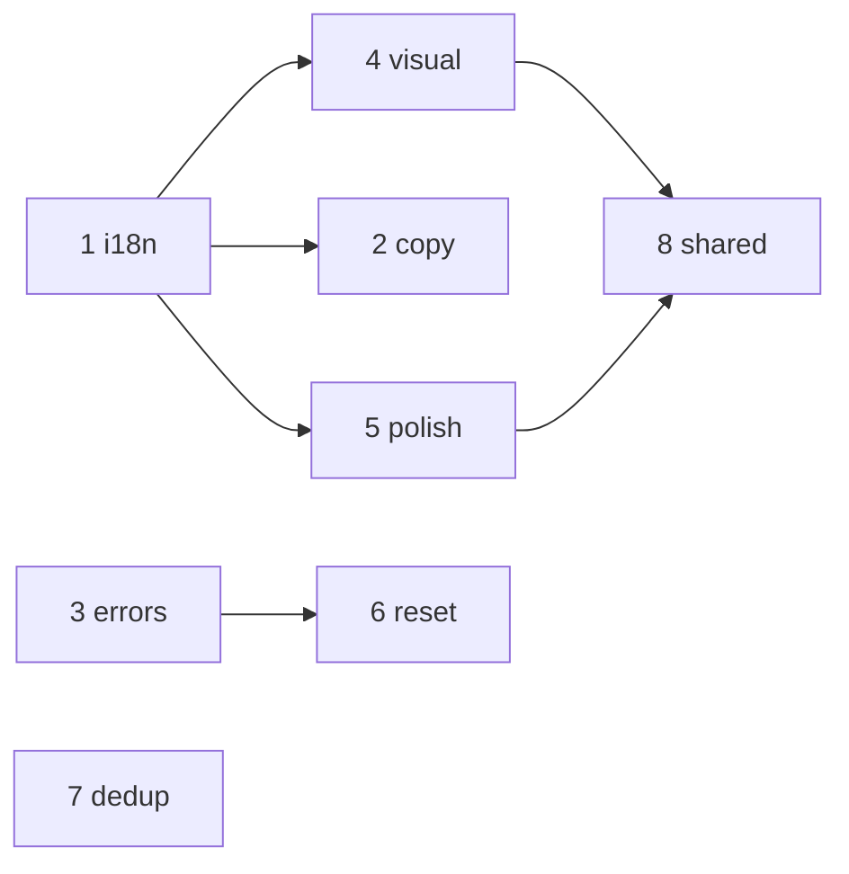

# Profile & Lobby Settings — промти для покращень (2026-06)

> Джерело аудиту: сесія review ProfileScreen, ProfileSettingsScreen, LobbySettingsScreen та пов’язаного UI.  
> Канон layout/TMA: [`TMA_LAYOUT.md`](./TMA_LAYOUT.md), typography: [`TYPOGRAPHY_UNIFICATION.md`](./TYPOGRAPHY_UNIFICATION.md).

## Контекст (коротко)

| Екран | Файл | Призначення |
|-------|------|-------------|
| Профіль | `packages/client/src/screens/menu/ProfileScreen.tsx` | Hero, stats, nav до settings |
| Налаштування профілю | `packages/client/src/screens/menu/ProfileSettingsScreen.tsx` | Avatar, ім’я, акаунт, push, PWA |
| Дефолти лоббі | `packages/client/src/screens/menu/LobbySettingsScreen.tsx` | **Стандартні** налаштування для **нових** кімнат (API `saveLobbySettings`) |
| Налаштування кімнати | `packages/client/src/screens/lobby/SettingsScreen.tsx` | **Live** sync поточної кімнати (host, Socket) |
| App settings | `packages/client/src/components/Settings/AppSettingsModal.tsx` | UI-мова, тема, звук (меню ⚙️) |

**Reference для візуалу:** `PlayerStatsScreen.tsx` (theme bg + dots), `ProfileScreen.tsx` (glow, glass footer).

---

## Шаблон на кожну сесію

```
Перед змінами: .cursor/CURRENT_FOCUS.md, AUDIT_RESULTS.md, docs/PROFILE_LOBBY_SETTINGS_IMPROVEMENT_PROMPTS.md (секція нижче).
Після: pnpm typecheck, pnpm --filter @movli/client test, CHANGELOG [Unreleased] якщо user-visible, .cursor/CURRENT_FOCUS.md.
Мінімальний diff. Не чіпати GameSyncState / @movli/shared без потреби.
```

---

## Швидкі промти (copy-paste)

> Формат: `@movli-steward` + номер сесії. Агент читає **повну** секцію з цього файлу.

| # | Швидкий промт |
|---|---------------|
| **0** | `@movli-steward Виконай сесію 0 з docs/PROFILE_LOBBY_SETTINGS_IMPROVEMENT_PROMPTS.md (pre-flight + verify baseline).` |
| **1** | `@movli-steward Сесія 1: i18n ProfileSettingsScreen + LobbySettingsScreen — docs/PROFILE_LOBBY_SETTINGS_IMPROVEMENT_PROMPTS.md` |
| **2** | `@movli-steward Сесія 2: пояснення дефолти лоббі vs налаштування кімнати — docs/PROFILE_LOBBY_SETTINGS_IMPROVEMENT_PROMPTS.md` |
| **3** | `@movli-steward Сесія 3: error feedback при save профілю/lobby defaults — docs/PROFILE_LOBBY_SETTINGS_IMPROVEMENT_PROMPTS.md` |
| **4** | `@movli-steward Сесія 4: візуальна уніфікація settings screens з profile flow — docs/PROFILE_LOBBY_SETTINGS_IMPROVEMENT_PROMPTS.md` |
| **5** | `@movli-steward Сесія 5: LobbySettings — категорії, прапори, toggles, haptics — docs/PROFILE_LOBBY_SETTINGS_IMPROVEMENT_PROMPTS.md` |
| **6** | `@movli-steward Сесія 6: Reset lobby defaults — confirm + семантика — docs/PROFILE_LOBBY_SETTINGS_IMPROVEMENT_PROMPTS.md` |
| **7** | `@movli-steward Сесія 7: ProfileScreen dedup stats + guest/store nav — docs/PROFILE_LOBBY_SETTINGS_IMPROVEMENT_PROMPTS.md` |
| **8** | `@architect @movli-steward Сесія 8: shared settings primitives + unsaved changes — docs/PROFILE_LOBBY_SETTINGS_IMPROVEMENT_PROMPTS.md` |
| **A** | `Мікро A: ProfileSettings avatar preview + email overflow — docs/PROFILE_LOBBY_SETTINGS_IMPROVEMENT_PROMPTS.md` |
| **B** | `Мікро B: SettingsScreen header → ScreenTitle — docs/PROFILE_LOBBY_SETTINGS_IMPROVEMENT_PROMPTS.md` |
| **C** | `@movli-steward Мікро C: guest path до lobby defaults — docs/PROFILE_LOBBY_SETTINGS_IMPROVEMENT_PROMPTS.md` |

### Ультра-короткі (одним рядком)

```
i18n menu settings → docs/PROFILE_LOBBY_SETTINGS_IMPROVEMENT_PROMPTS.md §1
lobby defaults copy → §2 | save errors → §3 | visual shell → §4
LobbySettings polish → §5 | reset fix → §6 | profile dedup → §7
shared toggles/sliders → §8 | avatar/email → §A | header unify → §B | guest defaults → §C
```

---

## Порядок і залежності



| Порядок | Сесія | P | ~час | Залежить від |
|--------|-------|---|------|--------------|
| 0 | Pre-flight | — | 15 хв | — |
| 1 | i18n | P0 | 1–2 год | — |
| 2 | Copy / explain | P0 | 30–60 хв | 1 |
| 3 | Error feedback | P0 | 30–60 хв | — |
| 4 | Visual unify | P1 | 1–2 год | — |
| 5 | Lobby UI polish | P1 | 2–3 год | 1 |
| 6 | Reset fix | P1 | 1–2 год | 3 |
| 7 | Profile dedup | P1 | 30–60 хв | — |
| 8 | Shared primitives | P2 | 3–5 год | 4, 5 |
| A–C | Мікро | P1–P2 | 30–90 хв | за контекстом |

---

## Сесія 0 — Pre-flight

```
@movli-steward Pre-flight для epic Profile/Lobby Settings improvements.

1. Прочитай docs/PROFILE_LOBBY_SETTINGS_IMPROVEMENT_PROMPTS.md (контекст таблиця).
2. Переліч файли: ProfileScreen, ProfileSettingsScreen, LobbySettingsScreen, SettingsScreen, ProfileNavList, PlayerStatsScreen, translations.ts, api fetchLobbySettings/saveLobbySettings.
3. pnpm typecheck + pnpm --filter @movli/client test — baseline має бути green.
4. Поверни: що вже зроблено в repo vs відкриті пункти аудиту; рекомендований порядок сесій 1–8.
```

---

## Сесія 1 — P0: i18n

**Швидко:** `@movli-steward Сесія 1 з docs/PROFILE_LOBBY_SETTINGS_IMPROVEMENT_PROMPTS.md`

### Повний промт

```
@movli-steward Pre-flight: i18n для ProfileSettingsScreen і LobbySettingsScreen.

Контекст: обидва екрани мають захардкоджені українські рядки; ProfileScreen/PlayerStatsScreen використовують useT().

Задача:
1. Додати ключі в packages/client/src/constants/translations.ts (UA, DE, EN) для ВСІХ user-facing рядків у:
   - packages/client/src/screens/menu/ProfileSettingsScreen.tsx
   - packages/client/src/screens/menu/LobbySettingsScreen.tsx
2. Підключити useT(); прибрати hardcoded UA.
3. Оновити LobbySettingsScreen.test.tsx — не прив’язувати assertions до однієї мови (role/name або ключі через mock useT).

Acceptance:
- uiLanguage DE/EN — 0 hardcoded UA на цих екранах
- pnpm typecheck + client tests green
- rg українських UI-рядків у цих двох tsx (поза t.*) — 0

Не чіпати GameSyncState / server.
```

**Файли:** `ProfileSettingsScreen.tsx`, `LobbySettingsScreen.tsx`, `translations.ts`, `LobbySettingsScreen.test.tsx`

---

## Сесія 2 — P0: пояснення дефолти vs кімната

**Швидко:** `@movli-steward Сесія 2 з docs/PROFILE_LOBBY_SETTINGS_IMPROVEMENT_PROMPTS.md`

### Повний промт

```
@movli-steward Pre-flight: пояснити різницю LobbySettingsScreen (дефолти нових кімнат) vs SettingsScreen (live кімната).

Задача:
1. i18n (UA/DE/EN): info banner на LobbySettingsScreen («стандартні налаштування для нових ігор»).
2. Опційно: subtitle під «Налаштування лоббі» в ProfileNavList (labels з ProfileScreen).
3. Стиль: typographyClass.system / існуючі banner patterns — без нового design system.

Acceptance:
- Copy видимий на LobbySettingsScreen (+ nav якщо зроблено)
- Локалізація UA/DE/EN
- pnpm typecheck + client tests green
- Game logic без змін
```

**Файли:** `LobbySettingsScreen.tsx`, `ProfileNavList.tsx`, `ProfileScreen.tsx`, `translations.ts`

---

## Сесія 3 — P0: error feedback при save

**Швидко:** `@movli-steward Сесія 3 з docs/PROFILE_LOBBY_SETTINGS_IMPROVEMENT_PROMPTS.md`

### Повний промт

```
Задача: user-visible feedback при save/error на ProfileSettingsScreen і LobbySettingsScreen.

Контекст: catch блоки ковтають помилки.

Задача:
1. Успішний save — залишити «Збережено» / існуючий UX.
2. Помилка — showNotification (або існуючий патерн menu screens) + i18n.
3. Vitest: mock failed updateProfile / saveLobbySettings → assert error UI.

Acceptance:
- Failed save показує повідомлення користувачу
- pnpm typecheck + client tests green
- Без console.log
```

**Файли:** `ProfileSettingsScreen.tsx`, `LobbySettingsScreen.tsx`, `translations.ts`, нові/оновлені tests

---

## Сесія 4 — P1: візуальна уніфікація shell

**Швидко:** `@movli-steward Сесія 4 з docs/PROFILE_LOBBY_SETTINGS_IMPROVEMENT_PROMPTS.md`

### Повний промт

```
@movli-steward Pre-flight: уніфікувати shell ProfileSettingsScreen і LobbySettingsScreen з PlayerStatsScreen.

Reference:
- PlayerStatsScreen.tsx — currentTheme.bg + dot pattern
- ProfileScreen.tsx — FixedBottomBar glass (опційно)

Задача:
1. bg-ui-bg → currentTheme.bg + dot pattern (як PlayerStatsScreen).
2. Footer CTA: Button (size xl, fullWidth) або AccentFooterCta замість raw button.
3. Header: ScreenTitle (heading) — без зміни на label-style.
4. TMA safe area не ламати (ScreenShell + AppHeader).

Acceptance:
- Settings screens візуально в сім’ї Profile/PlayerStats
- pnpm typecheck + client tests green
- SettingsScreen (in-lobby) — out of scope цієї сесії
```

**Файли:** `ProfileSettingsScreen.tsx`, `LobbySettingsScreen.tsx`

---

## Сесія 5 — P1: LobbySettings UI polish

**Швидко:** `@movli-steward Сесія 5 з docs/PROFILE_LOBBY_SETTINGS_IMPROVEMENT_PROMPTS.md`

### Повний промт

```
Задача: патерни з SettingsScreen.tsx → LobbySettingsScreen.tsx.

1. Категорії: t.cat_* + lucide icons (як in-lobby), не raw enum GENERAL/FOOD.
2. Мова слів: LOBBY_LANG_FLAG з SettingsScreen.
3. skipPenalty toggle: role="switch", aria-checked (ref. SettingsScreen ~1288+).
4. Sliders: haptic на step (HAPTIC / useHapticFeedback — як SettingsScreen).

Acceptance:
- 0 raw Category enum у UI
- Toggle a11y ok
- pnpm typecheck + client tests green
- saveLobbySettings contract без змін
```

**Файли:** `LobbySettingsScreen.tsx`, `SettingsScreen.tsx` (read-only ref), `translations.ts`

---

## Сесія 6 — P1: Reset lobby defaults

**Швидко:** `@movli-steward Сесія 6 з docs/PROFILE_LOBBY_SETTINGS_IMPROVEMENT_PROMPTS.md`

### Повний промт

```
@movli-steward Pre-flight: виправити «Скинути» на LobbySettingsScreen.

Проблема:
- handleReset: saveLobbySettings({}) + setLocal(gameSettings) — не factory/server defaults
- Немає confirm

Задача:
1. Confirm dialog (LogoutConfirmBottomSheet / ConfirmationModal — канон проєкту).
2. Після confirm — коректний reset (fetch після save empty / initialState — уточни в api + gameReducer).
3. i18n title/body/confirm/cancel (UA/DE/EN).
4. Vitest: confirm + cancel + success path.

Acceptance:
- Reset потребує підтвердження
- UI після reset = server/factory defaults
- pnpm verify green
```

**Файли:** `LobbySettingsScreen.tsx`, `api.ts`, `gameReducer.ts`, `translations.ts`, tests

---

## Сесія 7 — P1: ProfileScreen dedup

**Швидко:** `@movli-steward Сесія 7 з docs/PROFILE_LOBBY_SETTINGS_IMPROVEMENT_PROMPTS.md`

### Повний промт

```
Задача: UX cleanup ProfileScreen.

1. Прибрати duplicate stats з authBenefits (ProfileBenefitsList) — stats вже в ProfileStatsCards.
2. Guest: один clear path до Store (кнопка в benefits АБО nav — не обидва без потреби).
3. Navigation до PLAYER_STATS лишається через ProfileStatsCards.

Acceptance:
- Auth: stats один раз (картки)
- pnpm --filter @movli/client test green
```

**Файли:** `ProfileScreen.tsx`, tests за наявності

---

## Сесія 8 — P2: shared primitives + dirty guard

**Швидко:** `@architect @movli-steward Сесія 8 з docs/PROFILE_LOBBY_SETTINGS_IMPROVEMENT_PROMPTS.md`

### Повний промт

```
@architect @movli-steward Pre-flight: shared settings UI + unsaved changes guard.

Part A — components (packages/client/src/components/settings/ або аналог):
- SettingsToggle (switch + haptic)
- SettingsSlider (range + label + haptic)
- LanguageChipRow (flags)
- CategoryChipGrid (icons + t.cat_*)
Мігрувати LobbySettingsScreen; incremental — не весь SettingsScreen (~1300 LOC) за раз.

Part B — dirty state:
- ProfileSettingsScreen + LobbySettingsScreen track unsaved
- Back (AppHeader / useTelegramBackButton): confirm якщо dirty
- i18n discard/save

Acceptance:
- DRY toggles/sliders/language між LobbySettings і SettingsScreen
- Vitest shared + dirty guard
- pnpm verify green
```

---

## Мікро-сесії

### A — Avatar preview + email overflow

**Швидко:** `Мікро A з docs/PROFILE_LOBBY_SETTINGS_IMPROVEMENT_PROMPTS.md`

```
1. AvatarDisplay — name з локального state (name.trim()), не лише profile.displayName.
2. Email row — truncate/min-w-0 для 375px.
3. Avatar grid tap targets ≥44px (grid-cols-5 або gap якщо треба).

Файл: ProfileSettingsScreen.tsx | pnpm --filter @movli/client test
```

### B — In-lobby SettingsScreen header

**Швидко:** `Мікро B з docs/PROFILE_LOBBY_SETTINGS_IMPROVEMENT_PROMPTS.md`

```
SettingsScreen.tsx: header title → ScreenTitle (як menu settings), замість label + tracking-[0.4em].
Game logic без змін. pnpm typecheck + client tests.
```

### C — Guest lobby defaults (product)

**Швидко:** `@movli-steward Мікро C з docs/PROFILE_LOBBY_SETTINGS_IMPROVEMENT_PROMPTS.md`

```
@movli-steward: guest access до LobbySettings.

Варіанти (обери з pre-flight або запитай):
A) localStorage defaults без auth
B) nav disabled + «Увійдіть для синхронізації»

Реалізуй один варіант + i18n. Authenticated saveLobbySettings не ламати.
CHANGELOG [Unreleased] якщо UX змінився.
```

---

## Чеклист аудиту (що закриває кожна сесія)

| Проблема аудиту | Сесія |
|-----------------|-------|
| Hardcoded UA | 1 |
| Незрозумілі «два settings» | 2 |
| Silent save errors | 3 |
| Flat bg-ui-bg vs profile theme | 4 |
| Raw categories, no flags, weak toggle | 5 |
| Reset semantics + no confirm | 6 |
| Duplicate stats, guest store dup | 7 |
| DRY + unsaved changes | 8 |
| Avatar/name preview, email overflow | A |
| In-lobby header inconsistency | B |
| Guest без lobby defaults | C |

---

## Verify після кожної сесії

```bash
pnpm typecheck
pnpm --filter @movli/client test
# опційно після UI:
pnpm test:e2e --grep @smoke
```

Оновити: `CHANGELOG.md` [Unreleased], `.cursor/CURRENT_FOCUS.md`, `docs/daily/YYYY-MM-DD.md` (Europe/Kyiv).
