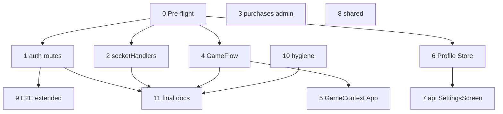

# TEST-COV-001 — розширення покриття тестами та синхронізація документації

**Status:** `implemented` (baseline 2026-06-13; **Session 0 ✅** … **Session 11 ✅**)  
**Scope:** `@movli/server`, `@movli/client`, `@movli/shared`, `@movli/e2e`, проєктні docs  
**Канон критеріїв:** [`TESTING_ACCEPTANCE.md`](./TESTING_ACCEPTANCE.md)  
**Пов’язано:** [`AGENT_BRIEF.md`](../AGENT_BRIEF.md), [`PROJECT_STATE.md`](../PROJECT_STATE.md), [`CONTRIBUTING.md`](./CONTRIBUTING.md)

---

## User story

**Як** команда MOVLI,  
**я хочу** щоб головні user flows і server contracts були покриті автотестами, а docs відображали фактичні лічильники й прогалини,  
**щоб** регресії ловились у CI до релізу, а AI-сесії могли виконуватись малими інкрементами.

**Acceptance criteria (epic):**

1. Усі тести green: server **357+**, client **398+**, shared **17+**, E2E **@smoke** + **@core**.
2. Server coverage floor **≥67%** (існуючий поріг у `vitest.config.ts`) — **зберегти**; цільові модулі: `routes/` **≥55%**, `handlers/` **≥65%**.
3. Client: **GameFlow** (мінімум PreRound → Playing → RoundSummary → Scoreboard) має Vitest smoke; **ProfileScreen** / **StoreScreen** — базові render + nav.
4. `docs/TESTING_ACCEPTANCE.md` містить матрицю «flow → guard test» без прогалин для P0 flows.
5. `AGENT_BRIEF.md`, `PROJECT_STATE.md`, `docs/INDEX.md` синхронізовані з лічильниками 2026-06-13.
6. Кореневий `package.json` має `test:client` (паритет з `test:server`).

---

## Знімок стану (аудит 2026-06-13)

| Пакет | Тести | Coverage (stmts/lines) | Поріг CI |
|-------|-------|------------------------|----------|
| `@movli/server` | **402** (21 files) | **75.63%** / branches 74% / funcs 92% | `test:coverage` у `ci.yml` |
| `@movli/client` | **480** (82 files) | **45.38%** (без floor у vitest) | `vitest run` у `ci.yml` |
| `@movli/shared` | **36** (4 files) | utils + lobbyReadiness + events + network | `vitest run` (не в кореневому verify) |
| `@movli/e2e` | **36 passed**, 4 skipped | — | `@smoke` + `@core` jobs; `@extended` optional |

**Verify (Session 11):** `pnpm verify` ✅ · `pnpm test:server` **402** ✅ · `pnpm test:client` **480** ✅ · `pnpm --filter @movli/shared test` **36** ✅ · server coverage **75.63%** (floor 67% OK).

### Що вже добре покрито (не дублювати без зміни коду)

| Область | Guard tests | Coverage |
|---------|-------------|----------|
| GameEngine, authorizeGameAction | `GameEngine.test.ts`, `authorizeGameAction.test.ts` | ~92% / ~100% |
| RoomManager, Redis, relay | `RoomManager.test.ts`, `RedisRoomStore.test.ts`, `RoomActionRelay.test.ts` | ~89% / ~78% / ~74% |
| Zod schemas | `schemas.test.ts` | ~93% |
| Offline client parity | `offlineGameActions.test.ts`, `gameReducer.test.ts` | behavior-first |
| Lobby / teams UI | `LobbyScreen.test.tsx`, `TeamSetupScreen.test.tsx`, `LobbyRulesSummaryCard.test.tsx` | integration |
| GameContext sync | `GameContext.test.tsx` | 13 cases |
| E2E critical paths | `smoke-round.spec.ts`, `core-acceptance.spec.ts` | CI |

### Критичні прогалини (залишок після epic)

| P | Область | Статус | Примітка |
|---|---------|--------|----------|
| **P2** | Client coverage floor | відкладено | жорсткий floor у `vitest.config.ts` — лише після Phase 4 client epic |
| **P2** | Мікро A–B | backlog | QuizModeHandler edge cases; `gameTask.ts` / `haptics.ts` unit tests |
| **P2** | D-4 deferred | за потреби | deep-link rejoin, auth bootstrap lifecycle |

*P0/P1 gaps з матриці нижче закриті сесіями 1–10.*

---

## Цільова архітектура тестів

```
                    ┌─────────────────────────────────────┐
                    │     docs/TESTING_ACCEPTANCE.md      │
                    │     (flows + invariants SSOT)       │
                    └─────────────────┬───────────────────┘
                                      │
        ┌─────────────────────────────┼─────────────────────────────┐
        ▼                             ▼                             ▼
  @movli/shared                 @movli/server                  @movli/client
  pure utils/constants          GameEngine + routes            GameContext + screens
  lobbyReadiness                socket int + relay             GameFlow smoke RTL
        │                             │                             │
        └─────────────────────────────┴─────────────────────────────┘
                                      │
                              @movli/e2e Playwright
                              @smoke @core (+ optional @extended)
```

**Принципи (з `.cursor/rules/05-testing.mdc`):**

- Тестувати **поведінку**, не implementation details.
- Нова `GameAction` → authorize + GameEngine + (за потреби) client offline.
- Новий REST route → integration test з auth + validation.
- GameFlow — display/role tests (explainer vs guesser), без дублювання server scoring.

---

## Roadmap — сесії

| # | Назва | P | ~час | Залежить від |
|---|-------|---|------|--------------|
| **0** | Pre-flight + baseline + doc sync | — | 30 хв | — |
| **1** | Server `auth.ts` integration | P0 | 2–3 год | 0 |
| **2** | Server `socketHandlers` expansion | P0 | 2–4 год | 0 |
| **3** | Server `purchases` + `admin` routes | P1 | 2–3 год | 0 |
| **4** | Client GameFlow smoke (round lifecycle) | P0 | 3–5 год | 0 |
| **5** | Client `GameContext` + App routing guards | P1 | 2–3 год | 4 |
| **6** | Client Profile + Store screens | P1 | 2–3 год | 0 |
| **7** | Client `api.ts` + lobby `SettingsScreen` | P1 | 2–3 год | 6 |
| **8** | Shared package expansion | P2 | 1–2 год | 0 |
| **9** | E2E `@extended` (store, profile) | P2 | 2–4 год | 1, 6 |
| **10** | Test hygiene + `test:client` script | P2 | 1–2 год | 0 |
| **11** | Final verify + documentation canon | — | 1 год | 1–10 |



---

## Шаблон на кожну сесію

```
Перед змінами: .cursor/CURRENT_FOCUS.md, docs/TEST_COVERAGE_EXPANSION_PROMPTS.md (секція сесії), docs/TESTING_ACCEPTANCE.md.
Після: pnpm typecheck; релевантні test:*; оновити TESTING_ACCEPTANCE (нові guard rows); CHANGELOG [Unreleased] якщо tooling/docs; .cursor/CURRENT_FOCUS.md.
TDD: спочатку failing test → мінімальний код лише якщо тест виявив баг; інакше лише тести.
Мінімальний diff. Не змінювати GameSyncState без shared + server + client.
```

---

## Швидкі промти (copy-paste)

| # | Швидкий промт |
|---|---------------|
| **0** | `@movli-steward Виконай сесію 0 з docs/TEST_COVERAGE_EXPANSION_PROMPTS.md (аудит baseline + sync AGENT_BRIEF).` |
| **1** | `@tdd-guide Сесія 1: server auth routes integration tests — docs/TEST_COVERAGE_EXPANSION_PROMPTS.md` |
| **2** | `@tdd-guide Сесія 2: socketHandlers relay/join/rejoin — docs/TEST_COVERAGE_EXPANSION_PROMPTS.md` |
| **3** | `@tdd-guide Сесія 3: purchases + admin routes — docs/TEST_COVERAGE_EXPANSION_PROMPTS.md` |
| **4** | `@tdd-guide Сесія 4: GameFlow Vitest smoke (round lifecycle) — docs/TEST_COVERAGE_EXPANSION_PROMPTS.md` |
| **5** | `@tdd-guide Сесія 5: GameContext + App GameRouter guards — docs/TEST_COVERAGE_EXPANSION_PROMPTS.md` |
| **6** | `@tdd-guide Сесія 6: ProfileScreen + StoreScreen RTL — docs/TEST_COVERAGE_EXPANSION_PROMPTS.md` |
| **7** | `@tdd-guide Сесія 7: client api.ts + lobby SettingsScreen — docs/TEST_COVERAGE_EXPANSION_PROMPTS.md` |
| **8** | `@tdd-guide Сесія 8: @movli/shared tests — docs/TEST_COVERAGE_EXPANSION_PROMPTS.md` |
| **9** | `@e2e-runner Сесія 9: E2E @extended store/profile — docs/TEST_COVERAGE_EXPANSION_PROMPTS.md` |
| **10** | `Сесія 10: act() hygiene + test:client script — docs/TEST_COVERAGE_EXPANSION_PROMPTS.md` |
| **11** | `@movli-steward Сесія 11: full verify + docs canon — docs/TEST_COVERAGE_EXPANSION_PROMPTS.md` |
| **A** | `Мікро A: QuizModeHandler + explainerModeActions edge cases (server)` |
| **B** | `Мікро B: client utils gameTask.ts + haptics.ts unit tests` |

### Ультра-короткі (одним рядком)

```
baseline docs → §0 | auth routes → §1 | socketHandlers → §2 | admin/stripe → §3
GameFlow RTL → §4 | GameRouter → §5 | profile/store → §6 | api/settings → §7
shared utils → §8 | E2E extended → §9 | hygiene → §10 | final docs → §11
```

---

## Сесія 0 — Pre-flight + baseline

**Мета:** зафіксувати лічильники, оновити застарілі docs, не писати нові тести.

**Кроки:**

1. `pnpm typecheck` · `pnpm test:server` · `pnpm --filter @movli/client test` · `pnpm --filter @movli/shared test`
2. `pnpm --filter @movli/server test:coverage` — записати % по `routes/`, `handlers/`, `services/`
3. Оновити `AGENT_BRIEF.md`: server **357**, client **398**, client coverage **~45%**
4. Перевірити `docs/TESTING_ACCEPTANCE.md` vs фактичні test files (таблиця guard tests)
5. `docs/daily/YYYY-MM-DD.md` + `.cursor/CURRENT_FOCUS.md`

**DoD:** docs відображають 2026-06-13 baseline; відкритий epic TEST-COV-001.

---

## Сесія 1 — Server `auth.ts` integration

**Мета:** покрити REST профілю та lobby defaults (включно з `sync-telegram-avatar`).

**Файли:**

- `packages/server/src/routes/auth.ts`
- `packages/server/src/routes/__tests__/auth.routes.test.ts` (розширити)

**Мінімальні кейси:**

| Endpoint | Кейси |
|----------|-------|
| `POST /api/auth/anonymous` | valid deviceId; invalid → 400 |
| `GET /api/auth/profile` | JWT required; 401 без токена |
| `PATCH /api/auth/profile` | sanitize name; reject HTML |
| `POST /api/auth/profile/save-lobby-settings` | Zod JSON; guest 401 |
| `POST /api/auth/profile/sync-telegram-avatar` | TMA initData mock; invalid HMAC → 401 |

**DoD:** `auth.ts` coverage **≥50%**; нові рядки в `TESTING_ACCEPTANCE.md` § Auth.

---

## Сесія 2 — Server `socketHandlers` expansion

**Мета:** закрити прогалини в room lifecycle та relay.

**Файли:**

- `packages/server/src/handlers/socketHandlers.ts`
- `packages/server/src/handlers/__tests__/socketHandlers.int.test.ts`

**Мінімальні кейси:**

- `room:create` з lobby defaults host user
- `room:join` — room full (`MAX_PLAYERS`), duplicate name
- `room:rejoin` — після grace expiry → помилка
- `game:action` relay timeout → `RELAY_*` error (mock `RoomActionRelay`)
- Host migration: другий гравець стає host після disconnect (інтеграція з `RoomManager`)

**DoD:** `socketHandlers.ts` **≥65%**; `TESTING_ACCEPTANCE.md` § Multiplayer оновлено.

---

## Сесія 3 — Server `purchases` + `admin` routes

**Мета:** Stripe webhook гілки та admin gate.

**Файли:**

- `packages/server/src/routes/purchases.ts`, `admin.ts`
- існуючі `__tests__/purchases.routes.test.ts`, `admin.routes.test.ts`

**Мінімальні кейси:**

- Stripe: `checkout.session.completed`, invalid event type, duplicate idempotency
- Admin: CRUD word pack happy path; 403 без IP whitelist; 401 без JWT

**DoD:** `purchases.ts` + `admin.ts` **≥45%** кожен.

---

## Сесія 4 — Client GameFlow smoke

**Мета:** RTL smoke для екранів раунду (без server scoring duplication).

**Файли (нові `*.test.tsx` поруч із екранами):**

- `PreRoundScreen.tsx` — explainer vs guesser copy
- `CountdownScreen.tsx` — renders timer label
- `PlayingScreen.tsx` — CORRECT/SKIP buttons visible for explainer only
- `RoundSummaryScreen.tsx` — confirm CTA
- `ScoreboardScreen.tsx` — shows team scores from mock state
- (опційно) `ImposterScreen.tsx` — phase labels without secret word in DOM

**Патерн:** mock `GameContext` / render з `GameSyncState` fixture; використати `packages/client/src/test/setup.ts`.

**DoD:** ≥5 нових test files; GameFlow folder **>0%** coverage; жодного `text-[Npx]` поза whitelist.

---

## Сесія 5 — Client `GameContext` + `App.tsx` routing

**Мета:** GameRouter показує правильний екран для кожного `GameState`.

**Файли:**

- `packages/client/src/App.tsx` (GameRouter)
- `packages/client/src/context/GameContext.test.tsx` (розширити)

**Мінімальні кейси:**

- `LOBBY` → LobbyScreen; `PLAYING` → PlayingScreen; `IMPOSTER` → ImposterScreen
- Offline mode: `handleGameAction` не викликає socket
- Deep link `?room=` restore (mock socket)

**DoD:** GameRouter table-driven test (≥8 states); `GameContext.test.tsx` +3 cases.

---

## Сесія 6 — Client Profile + Store screens

**Мета:** smoke для головних menu flows outside lobby.

**Файли:**

- `ProfileScreen.tsx`, `StoreScreen.tsx`, `MyWordPacksScreen.tsx`
- нові `ProfileScreen.test.tsx`, `StoreScreen.test.tsx`

**Мінімальні кейси:**

- Guest: login CTA, locked store packs
- Auth: nav to ProfileSettings, stats cards visible
- Store: catalog render, QuickBuy modal open (mock API)

**DoD:** 3 screens мають ≥1 render + ≥1 interaction test кожен.

---

## Сесія 7 — Client `api.ts` + lobby `SettingsScreen`

**Мета:** REST helpers і live lobby settings.

**Файли:**

- `packages/client/src/services/api.ts` → розширити `api.test.ts`
- `packages/client/src/screens/lobby/SettingsScreen.tsx` → новий test file

**Мінімальні кейси:**

- `fetchProfile`, `saveLobbySettings`, `buyStars` — mock `fetch` 401/500/200
- SettingsScreen: host sees save; guest read-only; `UPDATE_SETTINGS` action dispatch mock

**DoD:** `api.ts` **≥40%**; SettingsScreen host/guest cases.

---

## Сесія 8 — `@movli/shared` expansion

**Мета:** чисті функції та константи без runtime deps.

**Файли:**

- `packages/shared/src/network.ts`, `constants.ts`
- `packages/shared/src/__tests__/` — нові файли за потреби

**Мінімальні кейси:**

- Relay error codes / network timeouts constants snapshot
- `lobbyReadiness` — додаткові edge cases (0 players, SOLO, teamsLocked)

**DoD:** shared tests **≥25**; `pnpm --filter @movli/shared test` green.

---

## Сесія 9 — E2E `@extended`

**Мета:** Playwright для flows поза smoke/core (не блокує CI за замовчуванням).

**Файли:**

- `packages/e2e/tests/extended-store.spec.ts` (новий, tag `@extended`)
- `packages/e2e/tests/extended-profile.spec.ts` (новий)

**Мінімальні кейси:**

- Auth user: profile settings save (mock або test user)
- Store: open pack → QuickBuy sheet (без реального Stripe)

**DoD:** specs tagged `@extended`; documented у `TESTING_ACCEPTANCE.md`; CI job optional / manual (`pnpm --filter @movli/e2e run test:extended`).

---

## Сесія 10 — Test hygiene + tooling

**Мета:** прибрати act() warnings, додати `test:client`.

**Кроки:**

1. `QuickBuyModal.test.tsx`, `LobbyScreen.test.tsx` — `await userEvent` + `waitFor` / `act` wrap
2. Корінь `package.json`: `"test:client": "pnpm --filter @movli/client test"`
3. (Опційно) `CONTRIBUTING.md` — `test:client` у таблиці скриптів
4. (Опційно) client `vitest.config.ts` — **не** додавати жорсткий coverage floor до Phase 4 done

**DoD:** 0 act warnings у цих файлах; `pnpm test:client` працює.

---

## Сесія 11 — Final verify + documentation canon

**Мета:** закрити epic, оновити всі канонічні docs.

**Кроки:**

1. `pnpm verify` + `pnpm test:server` + `pnpm test:client` + `pnpm --filter @movli/shared test`
2. `pnpm --filter @movli/server test:coverage` — поріг ≥67% не зламано
3. Оновити:
   - `docs/TESTING_ACCEPTANCE.md` — повна матриця guard tests
   - `AGENT_BRIEF.md` — лічильники, backlog TEST-COV-001 → completed
   - `PROJECT_STATE.md` — §7 CI якщо додано `test:client`
   - `CHANGELOG.md` [Unreleased]
   - `docs/INDEX.md` — цей файл у статусі implemented / in progress
   - `AUDIT_RESULTS.md` — новий блок **K: Test coverage expansion** ✅
4. `docs/daily/YYYY-MM-DD.md`

**DoD:** TEST-COV-001 позначено **implemented** у шапці цього файлу; `.cursor/CURRENT_FOCUS.md` next steps очищено.

**Session 11 виконано (2026-06-13):** `pnpm verify` + `test:server` **402** + `test:client` **480** + shared **36** green; server coverage **75.63%**; docs canon sync (`TESTING_ACCEPTANCE`, `AGENT_BRIEF`, `PROJECT_STATE`, `CHANGELOG`, `INDEX`, `AUDIT_RESULTS` Block K).

---

## Мікро-сесії (≤1 год)

### Мікро A — QuizModeHandler server edge cases

- Файл: `packages/server/src/modes/__tests__/ModeHandlers.test.ts` або окремий `QuizModeHandler.test.ts`
- Кейси: `GUESS_OPTION` first correct scores; wrong guess lockout; timer PER_TASK

### Мікро B — Client utils

- Файли: `utils/gameTask.ts`, `utils/haptics.ts`
- Unit tests без RTL

---

## Зв’язок з docs (що оновлювати коли)

| Подія | Файл |
|-------|------|
| Новий guard test file | `TESTING_ACCEPTANCE.md` таблиця invariants |
| Новий npm script | `PROJECT_STATE.md`, `CONTRIBUTING.md`, `README.md` |
| Зміна coverage floor | `packages/server/vitest.config.ts` + `AGENT_BRIEF.md` |
| Закриття epic | шапка цього файлу, `docs/INDEX.md`, `AUDIT_RESULTS.md` |

---

## Ризики та обмеження

- **GameFlow** — великі компоненти; тестувати ролі (explainer/guesser), не pixel-perfect UI.
- **E2E extended** — потребує Postgres + стабільного test user; тримати поза обов’язковим CI.
- **auth.ts** — не комітити реальні Telegram/Stripe ключі; лише mocks.
- **Coverage gaming** — не додавати trivial asserts; кожен тест має відповідати рядку в `TESTING_ACCEPTANCE.md`.

---

*Створено: 2026-06-13 — аудит після full verify (357 server + 398 client unit, 36 E2E pass).*
