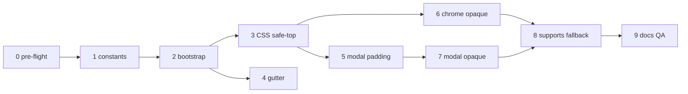

# TMA Desktop Layout & Glass — промти для виправлень (2026-06)

> **Статус epic:** ✅ Sessions 0–9 complete (2026-06-12). Канон: [`TMA_LAYOUT.md` — Desktop TMA](./TMA_LAYOUT.md#desktop-tma).  
> Джерело аудиту: сесія review Telegram Desktop (`tdesktop`, `macos`, `weba`, `webk`, `unigram`) — oversized header + excessive transparency (header, footer, modals).  
> Додатково: [`LIQUID_GLASS_FIX_PROMPTS.md`](./LIQUID_GLASS_FIX_PROMPTS.md), UI tokens: [`UI_TOKENS.md`](./UI_TOKENS.md).

## Контекст (коротко)

| Симптом на desktop | Root cause | Файли |
|--------------------|------------|-------|
| Хедер ~152–196px, порожній верх | Mobile floor `104px` на всіх платформах | `tmaLayoutConstants.ts`, `useTelegramApp.ts`, `styles.css` |
| 80px бокові відступи title row | `TG_CHROME_GUTTER_PX` без desktop guard | `GlassAppHeader.tsx`, `styles.css` |
| Модалки зсунуті вниз | `padding-top: var(--tma-inset-top)` на backdrop | `styles.css` |
| Хедер/футер/модалки «скляні» / прозорі | Liquid Glass = `transparent` + `backdrop-filter`; слабкий fallback | `glass.css`, `styles.css` |

**Що вже є:** `isTelegramDesktopPlatform()` вимикає `expand`/`requestFullscreen` — **layout не адаптований**.

**Інваріант:** mobile TMA @375px **не регресити** — floor 104px лишається для `ios` / `android`.

---

## Шаблон на кожну сесію

```
Перед змінами: .cursor/CURRENT_FOCUS.md, docs/TMA_DESKTOP_LAYOUT_FIX_PROMPTS.md (секція сесії).
Після: pnpm typecheck, pnpm --filter @movli/client test (релевантні describe), CHANGELOG [Unreleased] якщо user-visible.
Мінімальний diff. Не чіпати GameSyncState / @movli/shared без потреби.
Не рефакторити поза scope сесії.
Перевірка mobile: Vitest mocks platform=ios — floor 104px не змінився.
```

### Стандарти (обов'язково)

- **TMA mobile canon:** `@375px` — `--tma-content-top-floor: 104px`, gutter 80px, feather glass.
- **TMA desktop:** окремий floor (SSOT нижче), gutter off або мінімальний, opaque або high-opacity chrome.
- **Detection:** `isTelegramDesktopPlatform(webApp.platform)` + `data-telegram-desktop` на `<html>`.
- **CSS:** desktop overrides через `html[data-telegram-desktop]` — не media-query по ширині (desktop TG може бути вузьким вікном).
- **Тести:** `useTelegramApp.test.ts`, `tmaLayoutConstants.test.ts`, `GlassAppHeader.test.tsx` за потреби.

### Цільові константи (SSOT — уточнити на сесії 1 після DevTools)

| Константа | Mobile (без змін) | Desktop (нова) | Призначення |
|-----------|-------------------|----------------|-------------|
| `TELEGRAM_MOBILE_CONTENT_TOP_FLOOR_PX` | `104` | — | iOS Dynamic Island + TG chrome |
| `TELEGRAM_DESKTOP_CONTENT_TOP_FLOOR_PX` | — | `0` або `28`* | Нативний title bar поза WebView |
| `TG_CHROME_GUTTER_PX` | `80` | `0` на desktop | L/R clearance лише mobile |

\* Якщо SDK на desktop повертає позитивний `contentSafeAreaInset.top` — довіряти SDK, floor лише fallback `0`.

---

## Швидкі промти (copy-paste)

| # | Швидкий промт |
|---|---------------|
| **0** | `@movli-steward Сесія 0: TMA Desktop pre-flight — docs/TMA_DESKTOP_LAYOUT_FIX_PROMPTS.md` |
| **1** | `@movli-steward Сесія 1: desktop floor constants + tests — docs/TMA_DESKTOP_LAYOUT_FIX_PROMPTS.md` |
| **2** | `@movli-steward Сесія 2: bootstrap data-telegram-desktop + floor sync — docs/TMA_DESKTOP_LAYOUT_FIX_PROMPTS.md` |
| **3** | `@movli-steward Сесія 3: CSS safe-top overrides desktop — docs/TMA_DESKTOP_LAYOUT_FIX_PROMPTS.md` |
| **4** | `@movli-steward Сесія 4: AppHeader tgGutter off на desktop — docs/TMA_DESKTOP_LAYOUT_FIX_PROMPTS.md` |
| **5** | `@movli-steward Сесія 5: modal backdrop padding-top desktop — docs/TMA_DESKTOP_LAYOUT_FIX_PROMPTS.md` |
| **6** | `@movli-steward Сесія 6: opaque glass header/footer desktop — docs/TMA_DESKTOP_LAYOUT_FIX_PROMPTS.md` |
| **7** | `@movli-steward Сесія 7: opaque glass modals desktop — docs/TMA_DESKTOP_LAYOUT_FIX_PROMPTS.md` |
| **8** | `@movli-steward Сесія 8: @supports fallback gap (усі glass surfaces) — docs/TMA_DESKTOP_LAYOUT_FIX_PROMPTS.md` |
| **9** | `@movli-steward Сесія 9: docs sync + manual QA checklist — docs/TMA_DESKTOP_LAYOUT_FIX_PROMPTS.md` |

### Ультра-короткі (одним рядком)

```
pre-flight → §0 | constants → §1 | bootstrap attr → §2 | CSS safe-top → §3
gutter off → §4 | modal padding → §5 | chrome opaque → §6 | modal opaque → §7
fallback CSS → §8 | docs + QA → §9
```

---

## Порядок і залежності



| Порядок | Сесія | P | ~час | Залежить від |
|--------|-------|---|------|--------------|
| 0 | Pre-flight | — | 15 хв | — |
| 1 | Desktop constants | **P0** | 30–45 хв | 0 |
| 2 | Bootstrap + `data-telegram-desktop` | **P0** | 30–45 хв | 1 |
| 3 | CSS `--tma-content-safe-top` desktop | **P0** | 30 хв | 2 |
| 4 | `tgGutter` desktop guard | **P0** | 20–30 хв | 2 |
| 5 | Modal backdrop `padding-top` | P1 | 20–30 хв | 3 |
| 6 | Opaque header/footer glass | **P0** | 45–60 хв | 3 |
| 7 | Opaque modal glass | P1 | 45–60 хв | 5 |
| 8 | `@supports` fallback completion | P2 | 30–45 хв | 6–7 |
| 9 | Docs + manual QA | P1 | 30–60 хв | 1–8 |

**Паралельно після сесії 2:** §3 і §4 можна в одній сесії або розділити.

**Мінімальний MVP (3 запуски):** §1 + §2 + §3 → header height fixed.  
**MVP + читабельність (5 запусків):** + §4 + §6 → gutter + opaque chrome.  
**Повний epic:** §0–§9.

---

## Сесія 0 — Pre-flight + baseline

**Мета:** зафіксувати стан; не писати feature-код (окрім daily note).

**Задачі:**
1. Прочитати `.cursor/CURRENT_FOCUS.md`, цей файл, секцію glass у `TMA_LAYOUT.md`.
2. `pnpm typecheck` + `pnpm --filter @movli/client test` — baseline.
3. У Telegram Desktop DevTools зняти snapshot:
   - `Telegram.WebApp.platform`
   - `contentSafeAreaInset` / `safeAreaInset`
   - computed: `--tma-content-top-floor`, `--tma-content-safe-top`, `--app-page-header-height`
   - `CSS.supports('backdrop-filter: blur(1px)')`
4. Записати в `docs/daily/YYYY-MM-DD.md` — 5 рядків findings.
5. Оновити `.cursor/CURRENT_FOCUS.md` — «TMA Desktop fix epic, старт §N».

**Acceptance:** baseline зелений; desktop snapshot задокументований; `TELEGRAM_DESKTOP_CONTENT_TOP_FLOOR_PX` значення підтверджене (0 vs 28).

---

## Сесія 1 — Desktop floor constants

**Мета:** SSOT для desktop floor; тести; mobile без змін.

**Файли:**
- `packages/client/src/constants/tmaLayoutConstants.ts`
- `packages/client/src/constants/tmaLayoutConstants.test.ts`

**Задачі:**
1. Додати `TELEGRAM_DESKTOP_CONTENT_TOP_FLOOR_PX` (default `0` до уточнення з §0).
2. Додати helper `resolveTelegramContentTopFloorPx(platform?: string): number` — desktop → desktop constant, інакше mobile.
3. Експортувати `TELEGRAM_DESKTOP_DOCUMENT_FLAG = 'telegramDesktop'` (для `dataset` на html) — або константу рядка `'telegram-desktop'`.
4. Vitest: `tdesktop` → desktop floor; `ios` → 104; `undefined` → 104.

**Acceptance:** typecheck + tests pass; mobile constant не змінена.

---

## Сесія 2 — Bootstrap: platform floor + document flag

**Мета:** при старті TMA на desktop — правильний floor і `data-telegram-desktop`.

**Файли:**
- `packages/client/src/hooks/useTelegramApp.ts`
- `packages/client/src/hooks/useTelegramApp.test.ts`

**Задачі:**
1. У `bootstrapTelegramMiniApp()`:
   - `const floor = resolveTelegramContentTopFloorPx(webApp.platform)`
   - `setProperty(CSS_VAR_TMA_CONTENT_TOP_FLOOR, `${floor}px`)`
   - якщо desktop: `document.documentElement.dataset.telegramDesktop = 'true'` (або SSOT constant)
   - якщо mobile: `delete dataset.telegramDesktop`
2. У `applyTelegramSafeAreaCssVars`: для desktop **не** форсувати `Math.max(px, 104)` — використовувати `contentTopFloor` з кроку 1 (вже менший).
3. Тести: bootstrap `tdesktop` → floor 0 (або 28), `data-telegram-desktop`; `ios` → floor 104, без атрибута.

**Acceptance:** Vitest green; `pnpm build:shared` не потрібен (client-only).

---

## Сесія 3 — CSS safe-top overrides (desktop)

**Мета:** `--tma-content-safe-top` і похідні на desktop не clamp до 104px.

**Файли:**
- `packages/client/src/styles.css`

**Задачі:**
1. Додати блок `html[data-telegram-desktop]`:
   ```css
   html[data-telegram-desktop] {
     --tma-content-safe-top: var(
       --tg-content-safe-area-inset-top,
       var(--tma-content-top-floor, 0px)
     );
   }
   ```
   (без `max(..., 104px)` — mobile rule лишається на `html[data-telegram-app]:not([data-telegram-desktop])` або окремий selector)
2. Переконатися, що `html[data-telegram-app='true']` mobile rule **не** перебиває desktop (специфічність / порядок).
3. Оновити fallback `--app-page-header-height` для desktop: `max(var(--tma-content-safe-top), 44px)` — очікувано ~44–72px title row.
4. Перевірити `--app-home-card-top`, `--tma-toast-top`, `--tma-banner-top` — мають підхопити менший inset автоматично.

**Acceptance:** на desktop title row ≈ 44px (+ feather); mobile @375px без змін (grep + manual або Vitest не ламається).

---

## Сесія 4 — AppHeader: tgGutter off на desktop

**Мета:** прибрати 80px inline padding на desktop.

**Файли:**
- `packages/client/src/components/layout/GlassAppHeader.tsx`
- `packages/client/src/components/layout/GlassAppHeader.test.tsx`

**Задачі:**
1. Імпорт `isTelegramDesktopPlatform` з `useTelegramApp.ts`.
2. У `AppHeader`: `applyTgGutter = isTelegramSession && tgChromeGutter && !isTelegramDesktopPlatform(webApp?.platform)`.
   - Потрібен доступ до `platform` — через `getTelegramWebApp()?.platform` (без нового hook effect) або thin helper `shouldApplyTgChromeGutter()`.
3. Vitest: mock `platform: tdesktop` + initData → `data-tg-gutter` absent; `ios` → present.

**Acceptance:** desktop title row без `padding-inline: 80px`; mobile gutter збережено.

---

## Сесія 5 — Modal backdrop padding-top (desktop)

**Мета:** модалки не зсуваються на 104px вниз на desktop.

**Файли:**
- `packages/client/src/styles.css`

**Задачі:**
1. Замінити або доповнити:
   ```css
   html[data-telegram-app='true']:not([data-telegram-desktop]) .bottom-sheet-backdrop {
     padding-top: var(--tma-inset-top);
   }
   ```
2. Опційно для desktop: `padding-top: 0` або `max(0px, var(--tg-content-safe-area-inset-top, 0px))`.
3. Перевірити `EnterNameSheet`, `LoginModal`, `LobbyInvite` — sheet top не під нативним title bar вікна (title bar поза WebView).

**Acceptance:** modal sheet на desktop починається від верху WebView; mobile TMA backdrop clearance збережено.

---

## Сесія 6 — Opaque glass: header + footer (desktop)

**Мета:** хедер і футер читабельні без залежності від `backdrop-filter`.

**Файли:**
- `packages/client/src/styles/glass.css` (або `styles.css` після import)

**Задачі:**
1. Блок `html[data-telegram-desktop]`:
   - `.ui-app-header::before`, `.footer-island::before`, `.ui-app-footer::before` — `display: none` або blur optional
   - `.ui-app-header::after`, `.footer-island::after`, `.ui-app-footer::after` — opaque/high-opacity fill:
     ```css
     background: color-mix(in srgb, var(--ui-elevated, var(--ui-card)) 92%, transparent);
     mask-image: none;
     ```
   - Зменшити або прибрати feather `padding-bottom`/`padding-top` на desktop (опційно — менший `--ui-app-header-feather-height: 0` або `16px`)
2. **Не** чіпати mobile glass mask/feather.
3. Візуально: header має виглядати як суцільна панель, не «привид».

**Acceptance:** desktop header/footer opacity ≥ ~90% на title/control band; mobile feather glass без змін.

---

## Сесія 7 — Opaque glass: modals (desktop)

**Мета:** backdrop і panel модалок непрозорі / високої opacity на desktop.

**Файли:**
- `packages/client/src/styles.css`

**Задачі:**
1. `html[data-telegram-desktop] .bottom-sheet-backdrop::before` — сильніший tint (opacity 85–92%), blur optional off.
2. `html[data-telegram-desktop] .bottom-sheet-backdrop::after` — `display: none` або merge в один шар.
3. `html[data-telegram-desktop] .bottom-sheet-panel` — `background: color-mix(in srgb, var(--ui-card) 96%, ...)`; panel `::after` mask `none` (без transparent top band).
4. `html[data-telegram-desktop] .bottom-sheet-top-bar` — opaque bar (аналог header).
5. Перевірити nested modals (`zLayer=modalNested`) — той самий стиль.

**Acceptance:** LoginModal / EnterNameSheet / QuickJoin на desktop — panel і backdrop читабельні; mobile glass esthetic збережено.

---

## Сесія 8 — `@supports not (backdrop-filter)` gap

**Мета:** клієнти без blur (включно з деградацією WebView) отримують opaque UI на **всіх** платформах.

**Файли:**
- `packages/client/src/styles.css`
- `packages/client/src/styles/glass.css`

**Задачі:**
1. Розширити `@supports not (...)` у `styles.css`:
   - `.bottom-sheet-backdrop::before/::after` — opaque gradient (як у `prefers-reduced-transparency`)
   - `.bottom-sheet-panel` — solid `--ui-card` background
2. У `glass.css` `@supports` — підняти opacity fallback header/footer до ≥ 88% (зараз 82%/54%).
3. Не дублювати правила з §6–7 — desktop opaque може співпадати з supports fallback.

**Acceptance:** в DevTools emulate «disable backdrop-filter» — UI лишається usable на mobile і desktop.

---

## Сесія 9 — Docs sync + manual QA checklist ✅

**Мета:** канон документації + чекліст для owner QA.

**Файли:**
- `docs/TMA_LAYOUT.md` — секція **«Desktop TMA»** ✅
- `CHANGELOG.md` [Unreleased] ✅ (Fixed entries §1–8)
- `.cursor/CURRENT_FOCUS.md` ✅
- `docs/daily/2026-06-12.md` ✅

**Виконано (2026-06-12):**
1. `TMA_LAYOUT.md#desktop-tma` — detection, bootstrap, CSS policy table, anti-patterns, DevTools snippet.
2. Constants table оновлено: `TELEGRAM_DESKTOP_CONTENT_TOP_FLOOR_PX`, helpers.
3. Manual QA checklist (7 кроків) — owner pending на `tdesktop`/`macos`.
4. Verify: typecheck ✅, client **376/376** ✅.

**Acceptance:** docs↔code ✅; owner checklist у `TMA_LAYOUT.md` ✅; epic ✅ у `CURRENT_FOCUS.md`.

---

## Anti-patterns (не робити)

| Заборонено | Чому |
|------------|------|
| `@media (min-width: 768px)` для TMA desktop fix | Telegram desktop window може бути вузьким |
| Зменшити mobile floor 104 → 88 | Регресія iOS Dynamic Island QA |
| Hardcode `padding-top: 0` на всіх TMA | Зламає mobile modal clearance |
| Повністю прибрати Liquid Glass на mobile | Out of scope — лише desktop overrides |
| Змінити `GameSyncState` / shared | Client-only layout epic |

---

## Verification (кожна сесія)

```bash
pnpm typecheck
pnpm --filter @movli/client test
# опційно після §6–7:
rg "data-telegram-desktop" packages/client/src
rg "TELEGRAM_DESKTOP" packages/client/src
```

**Mobile regression grep:**

```bash
rg "TELEGRAM_MOBILE_CONTENT_TOP_FLOOR_PX|104" packages/client/src/constants/tmaLayoutConstants.ts
```

---

## Посилання

- Desktop platform detection: `useTelegramApp.ts` → `TELEGRAM_DESKTOP_PLATFORMS`
- Header title row grid: `styles.css` → `.ui-app-header__title-row`
- Modal TMA padding: `styles.css` → `html[data-telegram-app] .bottom-sheet-backdrop`
- Glass tokens: `glass.css`, `styles.css` → `--ui-chrome-glass-opacity-*`
